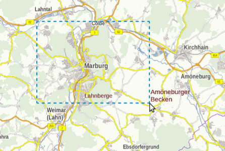

Zoomen
======

Es gibt drei verschiedene Möglichkeiten in der GBD WebSuite zu zoomen. Zum einen kann das Zoomen über die Maus gesteuert werden.
Hierzu wird das Mausrad genutzt. Zum Vergrößern wird das Mausrad nach vorne und zum Verkleinern nach hinten gedreht.
Des Weiteren gibt es noch die Möglichkeit per Rechteck zu zoomen. Dafür hält man die Shift-Taste gedrückt und zieht ein Rechteck in der Karte. Dieses Rechteck definiert wie weit in die Karte rein gezommt werden soll.

Zuletzt kann das Zoomen durch die Navigationsbutton |zoomin| ``Hineinzoomen`` und |zoomout| ``Hinauszoomen`` in der Statusleiste vorgenommen werden.

Mit der linken Maustaste oder dem gedrückten Mausrad, kann die Karte bewegt werden.

Als weitere Steuerfunktion kann über |zoommap| ``Ganzes Projekt anzeigen``, auf die Ausdehnung der gesamten Karte heraus gezoomt werden.

.. note::
 Falls diese Navigationshilfen nicht gewünscht sind oder sich anders verhalten sollen, können auch diese verändert und angepasst werden.

 .. |zoomin| image:: ../../../images/zoom-24.svg
   :width: 30em
 .. |zoomout| image:: ../../../images/zoom_out.svg
   :width: 30em
 .. |zoommap| image:: ../../../images/zoom_reset.svg
   :width: 30em
