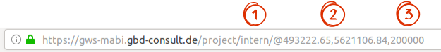

URL Informationen
=================

DIe GBD WebSuite schreibt einige Informationen auch in die aktuelle URL. Es werden Informationen darüber gegeben in welchem Projekt, in welcher Zoomstufe und in welchem Ausschnitt der Karte man sich befindet. All diese Informationen sind aus der URL abzulesen. Auf dem Screenshot von hinten angefangen kann man folgendes ablesen.

|1| = Name des Projektes

|2| = Koordinaten des Mittelpunktes des Kartenausschnittes

|3| = Zoomstufe

In unserem Beispiel hier ist der Name des Projektes "intern", die Koordinaten des Mittelpunktes "493222.65 , 5621106.84" und die Zoomstufe "200000".

Sehr praktisch ist diese Eigenschaft wenn man seinen Ausschnitt mit jemandem teilen möchte. Man muss einfach nur den Link aus der URL kopieren und verschicken. Der andere Nutzer öffnet diesen Link und ist automatsich bei dem gleichen Kartenausschnitt, in der gleichen Zoomstufe. Er muss jedoch dafür im gleichen Projekt angemeldet sein.

 .. |1| image:: ../../../images/gws_digits-01.svg
    :width: 30em
 .. |2| image:: ../../../images/gws_digits-02.svg
    :width: 30em
 .. |3| image:: ../../../images/gws_digits-03.svg
    :width: 30em
