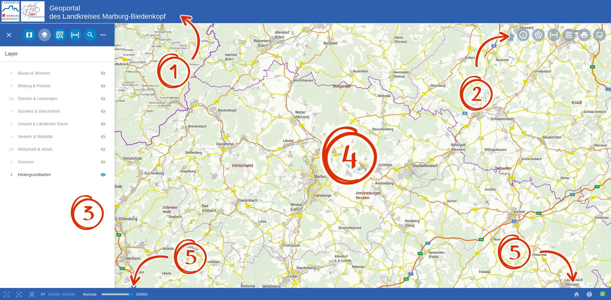

GBD WebSuite
============

Funktionalität
..............

Die **GBD WebSuite** bietet eine Vielzahl an Funktionalitäten, welche auf Basis von Plugins zur Verfügung gestellt und flexibel konfiguriert werden können. Das Aussehen des GBD WebSuite Clients kann individuell an eine bestehende Umgebung angepasst oder in diese integriert werden. Die aktuelle Funktionalität umfasst:

* QGIS und QGIS Server Integration
* Caching von Getmap und GetPrint Anfragen
* Einbinden von Hintergrunddiensten
* Objektabfragen per Klick oder Mouseover
* Räumliche Suche von Objekten in der Karte
* Markieren und Messen in der Karte
* Bemaßung von Segmentlängen in der Karte
* Benutzer-Authentifizierung (LDAP-, Postgres- und Datei-basiert)
* Editieren von Punkten, Linien und Flächen
* ALKIS Integration (Flurstücksuche, Beauskunftung und Druck)
* Konfigurierbare Suche (Nominatim, ALKIS-Adressen und Postgres)
* Schnittstelle zur Fachanwendung D-ProCon (Demographische Analysen)
* Schnittstelle zur Fachanwendung GekoS Online (E-Government)
* Drucken in unterschiedlicher Auflösung inklusive redlining
* Screenshots erstellen im PNG-Format

GBD WebSuite Server und Client
..............................

Der **GBD WebSuite Server** basiert auf Python mit Support für PyQGIS und weiteren GIS Bibliotheken. Er läuft in einem WSGI Container hinter einem Caching NGINX Proxy.

Der **GBD WebSuite Client** basiert auf React JS und verwendet als Kartenbibliothek OpenLayers. Er besitzt ein responsive Design, das sich jeweils auf die Bildschirmauflösung des Clients einstellt. Um ein optimales Zusammenspiel mit OpenLayers zu erreichen und um die Erweiterung, Wartung und Pflege zu optimieren wurde ein UI Framework implementiert. Die UI Bibliothek wird über einen Abstraktionslayer angesprochen, sodass diese aktualisiert oder ersetzt werden kann, ohne den Kern der Plattform zu beeinflussen.

Da nahezu alle Server- und Client-Funktionalitäten Plugin-basiert sind, können sehr kleine, angepasste Tools für bestimmte Installationen und Zwecke bereitgestellt werden. Selbst die Integration von QGIS Funktionalitäten ist als Plugin realisiert. Dabei besteht die Möglichkeit, dass QGIS Desktop Benutzer über ein Plugin, Anpassungen an der Konfiguration von Server und Client vornehmen können.

Aufbau der GBD WebSuite
..............................

Im folgenden werden die einzelnen Elemente der GBD WebSuite erläutert. Die hier definierten Begriffe werden Sie die restliche Dokumentation über begleiten.

+------------------+-------------------+
||1|               | Kopfzeile         |
+------------------+-------------------+
||2|               | Werkzeugleiste    |
+------------------+-------------------+
||3|               | Menü              |
+------------------+-------------------+
||4|               | Kartenfenster     |
+------------------+-------------------+
||5|               | Statusleiste      |
+------------------+-------------------+

  .. |1| image:: ../../../images/gws_digits-01.svg
    :width: 35em
  .. |2| image:: ../../../images/gws_digits-02.svg
    :width: 35em
  .. |3| image:: ../../../images/gws_digits-03.svg
    :width: 35em
  .. |4| image:: ../../../images/gws_digits-04.svg
    :width: 35em
  .. |5| image:: ../../../images/gws_digits-05.svg
    :width: 35em

.. GBD WebSuite Namenskonventionen
.. .................................

.. Die GBD WebSuite ist eine WebGIS Anwendung. Demzufolge verwendet diese für die Darstellung von Daten in der Karte WebGIS Layer und WebGIS Gruppen. Um in der nachfolgenden Anleitung kurze Namen verwenden zu können, folgt eine Übersicht von verwendeten Abkürzungen.
