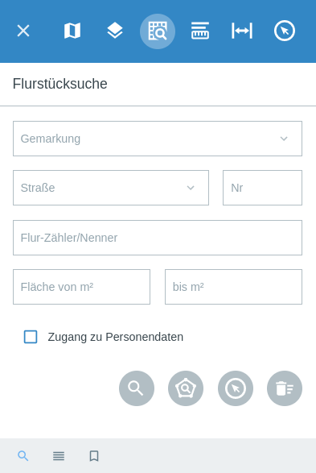
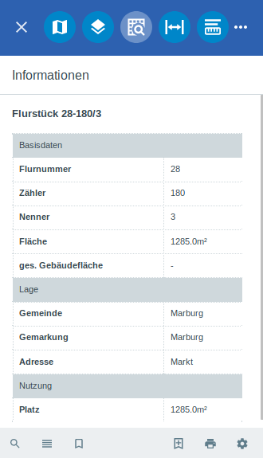
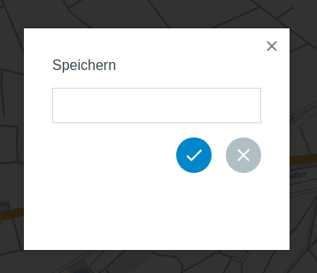
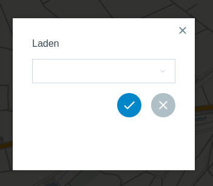

Flurstücksuche
==============

In der Menüleiste |menu| findet man unter |cadastralunit| die ``Flurstücksuche``, welche auf amtlichen ALKIS-Daten beruht. Diese Funktion steht erst zur Verfügung, wenn ein Benutzer mit
ALKIS-Zugrissrechten angemeldet ist. Die Datenbank auf der die Suche basiert, logt jede Anfrage. So kann anhand eines Aktenzeichens  verfolgt werden welcher Benutzer welche Suche gestartet hat.

Um einen Überblick zu erhalten, werden im folgenden Text die einzelnen Bestandteile genauer erläutert.

Starten der Flurstücksuche
--------------------------

Öffnet man die Flurstücksuche über die Menüleiste, ist als erstes die Suchmaske für Flurstücke zu sehen.
Hier stehen verschiedene Suchfelder zur Auswahl, welche auf verschiedene Weisen verwendet werden können.
Zum einen ist es möglich nach einem speziellen Flurstück zu suchen, indem die individuellen Daten eingegeben werden. Zum anderen können die Felder als Filter verwendet werden.
So kann zum Beispiel ohne Eigentümer oder nur nach Eigentümer oder Buchungsblattnummer gesucht werden.

Die Flurstücksuche wird über das Icon |search| ``Suche`` gestartet. Eine neue Anfrage kann per |new_search| ``Neue Anfrage`` gestartet werden.

Beschreibung der Felder
-----------------------

+------------------------+---------------------------------+
| **Feld**               | **Beispiel**                    |
+------------------------+---------------------------------+
| Vorname                | Max                             |
+------------------------+---------------------------------+
| Nachname               | Mustermann                      |
+------------------------+---------------------------------+
| Gemarkung              | Albshausen (Rauschenberg)       |
+------------------------+---------------------------------+
| Straße                 | Am Bingel                       |
+------------------------+---------------------------------+
| Nummer                 | 2b                              |
+------------------------+---------------------------------+
| Flur-Zähler/Nenner     | 6-30/6                          |
+------------------------+---------------------------------+
| Fläche                 | 30 bis 50 m²                    |
+------------------------+---------------------------------+
| Buchungsblattnummer    | 0013658                         |
+------------------------+---------------------------------+

.. note::
    Bei der Suche nach ``Flur-Zähler/Nenner`` ist explizit auf die Syntax zu achten:
    **Flur-Zähler/Nenner**. Optional kann auch nach den einzelnen Bestandteilen *Flur*, *Zähler* oder *Nenner* gesucht werden. Für die Suche nach einer bestimmten Straße, ist zuvor die Gemarkung auszuwählen.

Anzeigen der Ergebnisse
-----------------------

.. note::
 Bei der Ausgabe der Ergebnisse ist zu beachten, dass die Ergebnisspalte maximal 100 Ergebnisse ausgibt. Grund: Es wird eine weitere Spezifizierung erwartet.

Nach dem Anklicken des Suchbuttons |search| unter den Suchfeldern, werden die Ergebnisse in der Karte markiert und unter |results| ``Ergebnisse`` aufgelistet.

.. figure:: ../../../screenshots/de/client-user/cadastral_unit_searching_2.png
  :align: center

Durch Klicken auf die Flurstücksbezeichnung gelangen Sie zu den Flurstücksinformationen. Diese bestehen aus den Abschnitten Basisdaten, Lage, Gebäudenachweis, Buchungssatz und Nutzung. Falls Sie die Flurstücksinformationen wieder schließen möchten, wählen Sie den gewünschten Menüpunkt der Flurstücksuche.

.. Die gewonnenen Ergebnisse können durch klicken des neben dem Objekt stehenden |fokus| Symbol fokussiert werden. Außerdem ist es möglich über das Icon |add| ein Objekt der Ablage hinzu zu fügen oder über das |delete| Icon, ein Objekt wieder aus der Ablage zu entfernen. Oder über das |addall| Icon ebenfalls in der Leiste am unteren Fensterrand ``Alle zur Ablage`` hinzufügen.  So können Sie in der |tab| ``Ablage`` , welche ebenfalls am unteren Fensterrand der ``Flurstücksuche`` zu finden ist, eine Sammlung gesuchter Flurstücke anlegen und diese |save| ``Speichern``, |load| ``Laden``, |csv| als CSV-Datei exportieren oder |print| ``Drucken``.

Arbeiten mit der Ablage
-----------------------

.. .. figure:: ../../../screenshots/de/client-user/cadastral_unit_searching_3.png
  :align: center

Die nachfolgende Tabelle bildet eine Übersicht der vorhandenen Schaltflächen und deren Funktion im Ablagefenster ab.

+------------------------+--------------------------------------------------------------------------------------+
| **Icon**               | **Funktion**                                                                         |
+------------------------+--------------------------------------------------------------------------------------+
| |fokus|                | Zoomen auf das entsprechende Flurstück                                               |
+------------------------+--------------------------------------------------------------------------------------+
| |add|                  | ein Objekt zur Ablage hinzufügen                                                     |
+------------------------+--------------------------------------------------------------------------------------+
| |delete|               | ein Objekt aus der Ablage entfernen                                                  |
+------------------------+--------------------------------------------------------------------------------------+
| |addall|               | alle gewählten Objekte zur Ablage hinzufügen                                         |
+------------------------+--------------------------------------------------------------------------------------+
| |tab|                  | Ablage der ausgewählten Flurstücke                                                   |
+------------------------+--------------------------------------------------------------------------------------+
| |save|                 | Speichern der in der Ablage befindlichen Flurstücke                                  |
+------------------------+--------------------------------------------------------------------------------------+
| |load|                 | Öffnen von zuvor gespeicherten Ablagen von Flurstücken                               |
+------------------------+--------------------------------------------------------------------------------------+
| |csv|                  | Die in der Ablage befindlichen Flurstücke werden als CSV exportiert                  |
+------------------------+--------------------------------------------------------------------------------------+
| |print|                | Drucken der in der Ablage befindlichen Flurstücke, Ausgabe im Format PDF             |
+------------------------+--------------------------------------------------------------------------------------+
| |delete_shelf|         | Leeren der Ablage                                                                    |
+------------------------+--------------------------------------------------------------------------------------+

.. Wenn Sie ein einzelnes Objekt angewählt haben, gibt es zusätzlich Funktionen die nur dann möglich sind. Sie können zum einen wieder über das Icon |add| ein Objekt der Ablage hinzu zu fügen oder über das |delete| Icon, ein Objekt wieder aus der Ablage entfernen. Zusätzlich können die Informationen des Objektes gedruckt werden oder weitere Funktionen, ähnlich wie beim ``Auswahl``-Menü, gewählt werden. Die Erklärung für die Funktionen ``Räumliche Suche`` und ``Markieren und Messen`` entnehmen Sie bitte dem jeweiligen Punkt in dieser Hilfe. Über ``Auswahl`` kehren Sie wieder zum ursprünglichen ``Auswahl``-Werkzeug zurück. Über |fokus| ``Hinzoomen`` fokussieren Sie das gewünschte Objekt.

Exportieren
^^^^^^^^^^^

**Exportieren als CSV**

Wählen Sie die gewünschten Daten für den Export aus und klicken Sie auf ``Exportieren``.

.. figure:: ../../../screenshots/de/client-user/cadastral_unit_searching_area_csv.png
  :align: center

.. note::
   Es kann passieren das bei der Auswahl aller Daten in der Ergebnistabelle einige Flurstücke mehrfach auftauchen.

**Exportieren als Druck**

Sobald |print| gedrückt wird, startet der Druck. Dies bedeutet dass der Kartenausschnitt vorher gewählt werden muss.

Speichern
^^^^^^^^^

Vergeben Sie einen gewünschten Namen und speichern Sie durch Klicken auf das Häckchen.

Laden
^^^^^

Wählen Sie eine vorhandene Datei und laden Sie diese durch Klicken auf das Häckchen.

.. note::
  Das Speichern geschieht in einer SQLite Datei.

Arbeiten mit der räumlichen Suche
---------------------------------

Mit Hilfe des Werkzeuges |spatial_search| ``Flurstücke über räumliche Suche finden`` ist es möglich, Flurstücke durch das Zeichnen von Geometrien zu ermitteln. Es öffnet sich in der Toolbar die Leiste für die Räumliche Suche, mit dem Verweis, dass nun in den Flurstücken gesucht wird.

**Beispiel: Auswahl Flurstücke durch Linie**

Wählen Sie das Tool Linie aus. Zeichnen Sie nun parallel zu einer Straße eine Linie und schließen Sie diese mit einem Doppelklick ab. Anschließend werden Ihnen die Flurstücke in den Ergebnissen aufgelistet, welche von der Linie geschnitten werden. Auf dem Screenshot unten sieht man ein mögliches Ergebnis.

 .. figure:: ../../../screenshots/de/client-user/cadastral_unit_searching_area_search.png
   :align: center

Auswahl eines Flurstücks in der Karte
-------------------------------------

Das Werkzeug |select| ``Auswahl eines Flurstücks in der Karte`` ermöglicht die Selektierung einzelner Flurstücke. Sobald das Werkzeug aktiviert ist, können Sie per Mausklick gewünschte Flurstücke aussuchen, welche dann in der Ablage aufgelistet werden.

 .. figure:: ../../../screenshots/de/client-user/cadastral_unit_searching_5.png
   :align: center

 .. |menu| image:: ../../../images/baseline-menu-24px.svg
   :width: 30em
 .. |cadastralunit| image:: ../../../images/gbd-icon-flurstuecksuche-01.svg
   :width: 30em
 .. |results| image:: ../../../images/baseline-menu-24px.svg
   :width: 30em
 .. |tab| image:: ../../../images/sharp-bookmark_border-24px.svg
   :width: 30em
 .. |fokus| image:: ../../../images/sharp-center_focus_weak-24px.svg
   :width: 30em
 .. |add| image:: ../../../images/sharp-control_point-24px.svg
   :width: 30em
 .. |addall| image:: ../../../images/gbd-icon-alle-ablage-01.svg
   :width: 30em
 .. |delete| image:: ../../../images/sharp-remove_circle_outline-24px.svg
   :width: 30em
 .. |save| image:: ../../../images/sharp-save-24px.svg
   :width: 30em
 .. |load| image:: ../../../images/gbd-icon-ablage-oeffnen-01.svg
   :width: 30em
 .. |csv| image:: ../../../images/sharp-grid_on-24px.svg
   :width: 30em
 .. |print| image:: ../../../images/baseline-print-24px.svg
   :width: 30em
 .. |search| image:: ../../../images/baseline-search-24px.svg
   :width: 30em
 .. |select| image:: ../../../images/gbd-icon-auswahl-01.svg
   :width: 30em
 .. |spatial_search| image:: ../../../images/gbd-icon-raeumliche-suche-01.svg
   :width: 30em
 .. |delete_shelf| image:: ../../../images/sharp-delete_forever-24px.svg
   :width: 30em
 .. |new_search|  image:: ../../../images/baseline-delete_sweep-24px.svg
   :width: 30em

.. Protokollierter Zugang zu Personendaten
.. ^^^^^^^^^^^^^^^^^^^^^^^^^^^^^^^^^^^^^^^
.. Zum einbehalten der Datenschutzrechte gibt es folgendes Werkzeug in der Flurstücksuche. Wenn jemand nach personenbezogenen Daten wie Vorname und Name sucht, muss das Häckchen bei  ``Zugang zu Personendaten`` gesetzt werden. Es öffnet sich ein Fenster in dem ein firmeninternes Aktenzeichen vergeben werden muss. Dieses Aktenzeichen verifiziert den Erhalt der personenbezogenen Daten. Außerdem wird jede Anfrag in einer PostGIS Datei abgelegt, sodass jede Anfrage protokolliert und somit kontrolliert werden kann.

.. .. figure:: ../../../screenshots/de/client-user/cadastral_unit_search_data_rights.png
