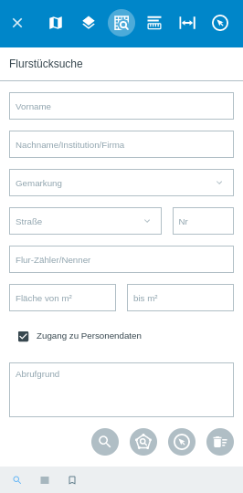

.. _cadastral_unit_searching:

Flurstücksuche
==============

In der Menüleiste |menu| findet man unter dem Symbol |cadastralunit| die ``Flurstücksuche``.
Diese kann auf amtliche ALKIS-Daten angewendet werden.
Das Modul an sich und der Zugriff darauf kann individuell projekt- und benutzerspezifisch konfiguriert.
Anfragen zum Einhalten des Datenschutzes können geloggt werden.

Um einen Überblick zu erhalten, werden im folgenden Text die einzelnen Bestandteile genauer erläutert.

.. rubric:: Starten der Flurstücksuche

Öffnet man die ``Flurstücksuche`` über die Menüleiste, ist als erstes folgende Suchmaske der Flurstücksuche zu sehen.

.. figure:: ../../../screenshots/de/client-user/cadastral_unit_searching_1.png
  :align: center

Es stehen verschiedene Flurstück-Parameter zur Auswahl, die individuell konfiguriert werden können.
So können Flurstücke anhand von Straßen, Gemarkungen, Flächengrößen, Buchungsblatt- oder Flurstücknummern gesucht werden.
Wenn der ``Zugang zu Personendaten`` aktiviert wird, ist es ebenfalls möglich, anhand von Vor- und Nachname Flurstücke zu suchen.
Der Zugang zu persönlichen Daten kann so konfiguriert werden, dass zum Beispiel nur verifizierte Nutzer Zugriff darauf haben.
Es ist möglich, dass alle Anfragen nach Personendaten geloggt und in einer PostGIS Datei abgelegt werden. So wird jede Anfrage protokolliert und kann kontrolliert werden.

.. .. figure:: ../../../screenshots/de/client-user/cadastral_unit_search_data_rights.png
  :align: center

Wenn der Zugang aktiviert ist, sieht die Suchmaske wie folgt aus.

Die Flurstücksuche wird über das Icon |search| ``Suche`` gestartet. Eine neue Suche kann per |new_search| ``Neue Anfrage`` gestartet werden.
Dabei werden die Inhalte aller Felder gelöscht. Die Erklärung für die Funktionen |spatial_search| ``Flurstücke über räumliche Suche finden``
und |select| ``Einzelne Flurstücke in der Karte auswählen`` erfolgt im späteren Teil dieses Kapitels.
Diese Funktionen können zusätzlich als Werkzeug in der Werkzeugleiste platziert werden.
Wenn Sie zum Beispiel ein GBD WebSuite Projekt nutzen, um damit ausschließlich Flurstücke zu verwalten, könnte dies von Nutzen sein.
So wäre ein schnelles Auswählen einzelner Flurstücke möglich, ohne den Menüpunkt ``Flurstücksuche`` auswählen zu müssen.
Dieser öffnet sich dann automatisch, wenn Sie das Werkzeug auswählen.

.. rubric:: Optionale Konfigurationen zur Darstellung der Gemarkungsliste

Es gibt verschiedene Möglichkeiten zur Konfiguration der Flurstücksuche. Es müssen nicht alle Parameter definiert werden.
So können Sie zum Beispiel definieren, ob die Suche nach einem speziellen Flurstück oder nach allen Flurstücken einer Straße erfolgen soll.
Um nach einer Straße zu suchen, muss keine Gemarkung eingetragen werden. So ist die Suche auch bei großen Datenmengen performant möglich.
Ob die Suche nach Straßen mit oder ohne Vorauswahl der Gemarkung stattfinden soll, kann ebenfalls konfiguriert werden.
Bei der Suche anhand von Mindest- und Maximalfläche in Quadratmetern, können Kommastellen für das Eintragen von Zentimeter-Werten verwendet werden.
Folgende Konfigurationen stehen zur Verfügung:

* keine Gemarkungsliste anzeigen
* die Gemarkungsliste anzeigen als eine Liste von Gemarkungsnamen
* die Gemarkungsliste anzeigen als eine Liste von Gemarkung- und Gemeindenamen in Klammern
* die Gemarkungsliste wird in einer Baumansicht angezeigt (erst Gemeinde, darunter eingerückt Gemarkung)

.. rubric:: Optionale Konfigurationen zur Darstellung der Straßenliste

* nur Straßennamen anzeigen
* Straßenname und Gemeindenamen in Klammern anzeigen

.. rubric:: Optionale Konfigurationen zur Straßensuche

* Die Eingabe "Mar" sucht am Anfang der Straßennamen und findet nur "Marktstraße"
* Die Eingabe "Mar" sucht überall in den Straßennamen und findet "Marktstraße" und "Neuer Markt"

.. note::
 Die Abfrage nach einer Buchungsblattnummer über das Buchungsblatt-Feld kann konfiguriert werden.
 So kann eine Plausibilität geprüft und frei definiert werden, welche Werte eingetragen werden, z.B. Zahlen oder Buchstaben,
 ob Bestimmte Werte am Anfang oder Ende oder grundsätzlich in dem Feld enthalten sein müssen.

.. rubric:: Anzeigen der Ergebnisse

Nach dem Anklicken des Suchbuttons |search| unter den Suchfeldern, werden die Ergebnisse in der Karte markiert und unter dem Reiter |results| ``Ergebnisse`` aufgelistet.

.. figure:: ../../../screenshots/de/client-user/cadastral_unit_searching_2.png
  :align: center

Durch ein Klicken auf die Flurstückbezeichnung, gelangen Sie zu den Flurstückinformationen. Diese können individuell konfiguriert werden und
bestehen in diesem Beispiel aus den Abschnitten Basisdaten, Lage, Gebäudenachweis, Buchungssatz und Nutzung.
Durch ein Klicken auf |fokus| ``Hinzoomen`` fokussieren Sie das ausgewählte Objekt. Über die Symbole |add| und |delete| rechts neben der Flurstückbezeichnung,
können einzelne Flurstücke in eine |tab| Ablage hinzugefügt oder herausgelöscht werden.
Über das |addall| Icon, welches sich ebenfalls in der Leiste am unteren Fensterrand befindet, können Sie ``Alle zur Ablage`` hinzufügen.
Diese kann für einen späteren Zugriff gespeichert werden.
Die darin befindlichen Flurstücke können ausgedruckt oder in eine CSV Tabelle exportiert werden.
Um die Flurstückinformationen wieder zu schließen, wählen Sie einen anderen Menüpunkt in der Flurstücksuche aus.

.. figure:: ../../../screenshots/de/client-user/cadastral_unit_searching_4.png
  :align: center

Die nachfolgende Tabelle bildet eine Übersicht der vorhandenen Schaltflächen und deren Funktion im Ablagefenster ab.

+------------------------+--------------------------------------------------------------------------------------+
| **Icon**               | **Funktion**                                                                         |
+------------------------+--------------------------------------------------------------------------------------+
| |fokus|                | Zoomen auf das entsprechende Flurstück                                               |
+------------------------+--------------------------------------------------------------------------------------+
| |add|                  | ein Objekt zur Ablage hinzufügen                                                     |
+------------------------+--------------------------------------------------------------------------------------+
| |delete|               | ein Objekt aus der Ablage entfernen                                                  |
+------------------------+--------------------------------------------------------------------------------------+
| |addall|               | alle gewählten Objekte zur Ablage hinzufügen                                         |
+------------------------+--------------------------------------------------------------------------------------+
| |tab|                  | Ablage der ausgewählten Flurstücke                                                   |
+------------------------+--------------------------------------------------------------------------------------+
| |save|                 | Speichern der in der Ablage befindlichen Flurstücke                                  |
+------------------------+--------------------------------------------------------------------------------------+
| |load|                 | Öffnen von zuvor gespeicherten Ablagen von Flurstücken                               |
+------------------------+--------------------------------------------------------------------------------------+
| |csv|                  | Die in der Ablage befindlichen Flurstücke werden als CSV exportiert                  |
+------------------------+--------------------------------------------------------------------------------------+
| |print|                | Drucken der in der Ablage befindlichen Flurstücke, Ausgabe im Format PDF             |
+------------------------+--------------------------------------------------------------------------------------+
| |delete_shelf|         | Leeren der Ablage                                                                    |
+------------------------+--------------------------------------------------------------------------------------+

Wenn Sie ein einzelnes Objekt angewählt haben, gibt es zusätzlich Funktionen die nur dann möglich sind.
Sie können zum einen wieder über das Icon |add| ein Objekt der Ablage hinzu zu fügen oder über das |delete| Icon,
ein Objekt wieder aus der Ablage entfernen. Zusätzlich, können die Informationen des Objektes gedruckt werden oder
ähnlich wie bei anderen Werkzeugen, weitere Funktionen gewählt werden.

.. note::
 Für die Ausgabe der Ergebnisse, kann die maximale Anzahl der Flurstücke konfiguriert werden.

.. rubric:: Exportieren und Drucken

.. rubric:: Exportieren als CSV

Die Flurstückinformationen bestehen aus unterschiedlichen Teilbereichen.
Beim Export in das CSV Format können Sie eine Auswahl treffen und dann auf den Button ``Exportieren`` klicken.

.. figure:: ../../../screenshots/de/client-user/cadastral_unit_searching_area_csv.png
  :align: center

.. note::
   Es kann passieren das bei der Auswahl aller Daten in der Ergebnistabelle einige Flurstücke mehrfach auftauchen.
   Das ist u.a. dann der Fall, wenn ein Flurstück mehrere Eigentümer hat.

.. rubric:: Drucken der Flurstückinformationen

Über das |print| Symbol können Sie die ausgewählten Flurstückinformationen drucken.
Der Inhalt des Ausdrucks, kann individuell über eine Vorlage vorbereitet werden.
Dieses kann auch eine Kartendarstellung des jeweiligen Flurstücks beinhalten.

.. rubric:: Arbeiten mit der Ablage

Die |tab| Ablage ist ein Bereich, der genutzt werden kann, um bestimmte Flurstücke einer Suchanfrage und/oder Ergebnisse mehrerer Suchanfragen abzulegen.
Man kann es als eine Art Sammelstelle verstehen, deren Inhalt letztlich für die Beauskunftung verwendet werden kann.

.. rubric:: Speichern

Über das |save| Symbol können Sie ausgewählte Flurstücke oder Flurstücke der Ablage in einer benutzerspezifischen Ablage speichern.
Vergeben Sie einen gewünschten Namen und speichern Sie durch Klicken auf das Häckchen.

.. figure:: ../../../screenshots/de/client-user/cadastral_unit_searching_print_save.png
  :align: center

.. rubric:: Laden

Über das |load| Symbol kann eine benutzerspefische Ablage wieder geladen werden. Wählen Sie einen Ablagenamen und laden Sie diese durch Klicken auf das Häckchen.

.. figure:: ../../../screenshots/de/client-user/cadastral_unit_searching_print_load.png
  :align: center

.. note::
  Das Speichern benutzerspefischer Ablagen geschieht in einer SQLite Datenbank.

.. rubric:: Flurstücke in der Karte suchen

Mit Hilfe des Werkzeuges |spatial_search| ``Flurstücke über räumliche Suche finden`` ist es möglich, Flurstücke durch das Zeichnen von Geometrien zu ermitteln.
Es öffnet sich in der Toolbar die Leiste für die Räumliche Suche, mit dem Verweis, dass nun in den Flurstücken gesucht wird.

**Beispiel: Auswahl Flurstücke durch Linie**

Wählen Sie das Tool Linie aus. Zeichnen Sie nun parallel zu einer Straße eine Linie und schließen Sie diese mit einem Doppelklick ab.
Anschließend werden Ihnen die Flurstücke in den Ergebnissen aufgelistet, welche von der Linie geschnitten werden. Auf dem Screenshot unten sieht man ein mögliches Ergebnis.

 .. figure:: ../../../screenshots/de/client-user/cadastral_unit_searching_area_search.png
   :align: center

.. rubric:: Flurstücke in der Karte wählen

Das Werkzeug |select| ``Einzelne Flurstücke in der Karte wählen`` ermöglicht die Selektierung einzelner Flurstücke.
Sobald das Werkzeug aktiviert ist, können Sie per Mausklick gewünschte Flurstücke aussuchen, welche dann in der Ablage aufgelistet werden.

 .. figure:: ../../../screenshots/de/client-user/cadastral_unit_searching_5.png
   :align: center

 .. |menu| image:: ../../../images/baseline-menu-24px.svg
   :width: 30em
 .. |cadastralunit| image:: ../../../images/gbd-icon-flurstuecksuche-01.svg
   :width: 30em
 .. |results| image:: ../../../images/baseline-menu-24px.svg
   :width: 30em
 .. |tab| image:: ../../../images/sharp-bookmark_border-24px.svg
   :width: 30em
 .. |fokus| image:: ../../../images/sharp-center_focus_weak-24px.svg
   :width: 30em
 .. |add| image:: ../../../images/sharp-control_point-24px.svg
   :width: 30em
 .. |addall| image:: ../../../images/gbd-icon-alle-ablage-01.svg
   :width: 30em
 .. |delete| image:: ../../../images/sharp-remove_circle_outline-24px.svg
   :width: 30em
 .. |save| image:: ../../../images/sharp-save-24px.svg
   :width: 30em
 .. |load| image:: ../../../images/gbd-icon-ablage-oeffnen-01.svg
   :width: 30em
 .. |csv| image:: ../../../images/sharp-grid_on-24px.svg
   :width: 30em
 .. |print| image:: ../../../images/baseline-print-24px.svg
   :width: 30em
 .. |search| image:: ../../../images/baseline-search-24px.svg
   :width: 30em
 .. |select| image:: ../../../images/gbd-icon-auswahl-01.svg
   :width: 30em
 .. |spatial_search| image:: ../../../images/gbd-icon-raeumliche-suche-01.svg
   :width: 30em
 .. |delete_shelf| image:: ../../../images/sharp-delete_forever-24px.svg
   :width: 30em
 .. |new_search|  image:: ../../../images/baseline-delete_sweep-24px.svg
   :width: 30em
