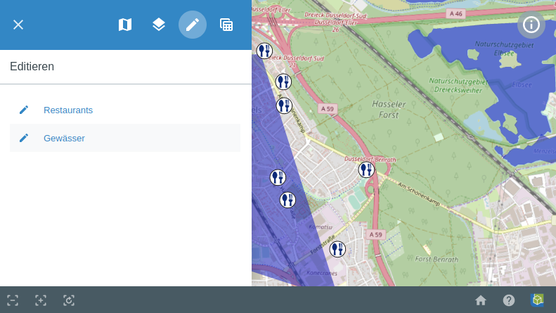
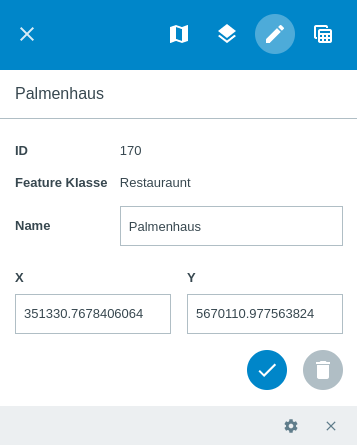

.. _editing:

Editieren
=========

In der Menüleiste |menu| ist ebenfalls der Unterpunkt |edit| ``Editieren`` zu finden.

Unter diesem Menüpunkt ist es möglich, verschiedene Objekte auszuwählen und zu editieren. Dafür müssen Sie in diesem Menüpunkt zuerst den Typ des Objektes auswählen, welchen Sie editieren möchten. Wählen Sie zwischen Punkt, Linie oder Polygon.

Als nächstes muss das gewünschte Objekt ausgewählt werden. Es kann über |fokus| neben dem Objekt, fokussiert werden. Auch hier befinden sich wieder hilfreiche Werkzeuge am unteren Fensterrand. Über |cancel| ``Beenden`` können Sie zum vorherigen Fenster gelangen. Außerdem kann hier das Werkzeug ``Zeichnen`` |new_editing| oder das Werkzeug ``Bearbeiten`` |select_editing| angewählt werden. Mit dem ``Bearbeiten`` Werkzeug ist es möglich, die zu editieren gewünschten Objekte in der Karte auszuwählen. Das ``Zeichnen`` Werkzeug bietet noch weitere Möglichkeiten. Hier ist es möglich, je nachdem welcher Layertyp vorhanden ist, neue Punkte, Linien oder Polygone hinzuzufügen.

Wenn ein Objekt ausgewählt ist, können Attribute wie zum Beispiel id, Name, Bezeichnung und Adresse bearbeitet werden. Es kann sein, dass gewisse Felder eine Eingabe erfordern, um das Objekt abzuspeichern. Ebenfalls können vorgegebene Wertebereich definiert sein, in denen die Eingabe liegen muss. Über das Menü |settings| ``Aufgaben`` können weitere Funktionen ausgewählt werden. Man kann zu einem Objekt ``Hinzoomen``.  Desweiteren können die vorher erstellten Objekte für die Funktionen ``Räumliche Suche``, ``Markieren und Messen`` oder ``Auswahl`` verwendet werden. Über |delete_editing| ist es möglich ein Objekt zu löschen und über |cancel| kommt man wieder ins vorherige Menü.

.. note::
 Falls diese Funktion nicht zur Verfügung stehen soll, ist es möglich diese zu deaktivieren. Es wäre zum Beispiel möglich, dass die Funktion ``Zeichnen`` nur Linien zeichnen kann aber keine Flächen. Oder diese Funktion ganz zu deaktivieren, wäre auch möglich.

 .. |menu| image:: ../../../images/baseline-menu-24px.svg
   :width: 30em
 .. |edit| image:: ../../../images/sharp-edit-24px.svg
   :width: 30em
 .. |select_editing| image:: ../../../images/cursor.svg
   :width: 30em
 .. |new_editing| image:: ../../../images/sharp-gesture-24px.svg
   :width: 30em
 .. |delete_editing| image:: ../../../images/baseline-delete-24px.svg
   :width: 30em
 .. |cancel| image:: ../../../images/baseline-close-24px.svg
   :width: 30em
 .. |fokus| image:: ../../../images/sharp-center_focus_weak-24px.svg
   :width: 30em
 .. |settings| image:: ../../../images/round-settings-24px.svg
   :width: 30em
