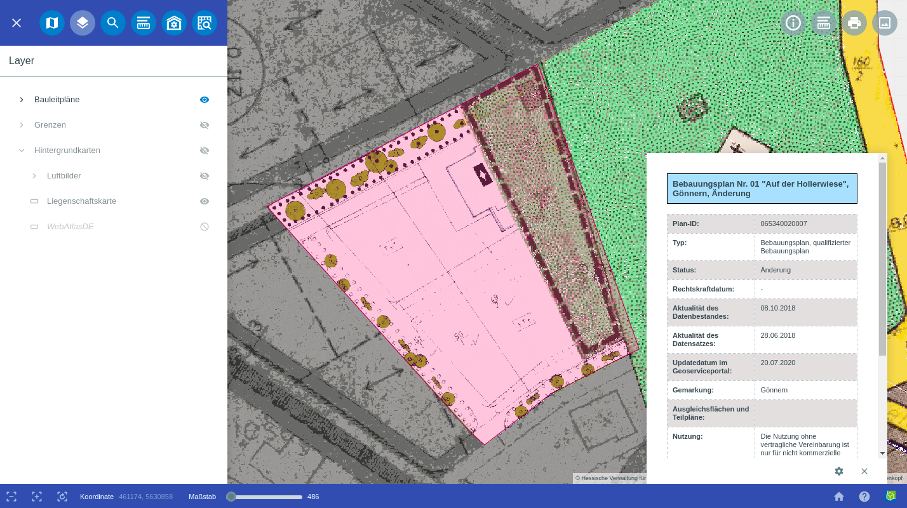
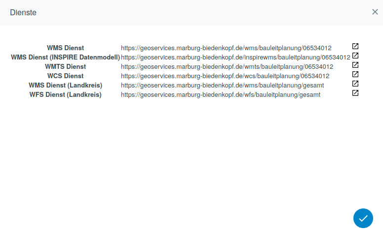

.. _inspire:

INSPIRE
=======

Das INSPIRE |bplan| Modul der GBD WebSuite ermöglicht einem Administrator momentan die dynamische Bereitstellung von Geodaten und deren Metadaten für das Fachthema Bauleitplanung entsprechend der INSPIRE Vorgabe. Es ist dabei so konzipiert, dass es zukünftig um weitere Fachthemen erweitert werden kann. Wenn mehrere Fachthemen vorhanden sind, kann im Vorfeld das Fachthema ausgewählt und den Daten zugewiesen werden.

Die INSPIRE konforme Bereitstellung der Geodaten findet auf Anfrage dynamisch durch den GBD WebSuite Server auf Basis von XML−Schemas statt. Das bedeutet, dass keine temporären, redundanten Daten erstellt und auf dem Server abgelegt werden. Die INSPIRE konformen Dienste basieren immer auf den aktuellen Originaldaten. Für Transformation von Gauß−Krüger nach ETRS89 ist ein geeigneter Transformationsansatz integriert.

Unterstützt wird die Bereitstellung folgender INSPIRE Dienste:

- INSPIRE konformer Catalogue Service for the Web (CSW)
- INSPIRE konformer Web Mapping Service (WMS/WMTS)
- Umsetzung INSPIRE konformer Web Feature Service (WFS)
- Umsetzung INSPIRE konformer Web Coverage Service (WCS)

Bauleitpläne anzeigen, suchen und löschen
-----------------------------------------

Nachdem sich der Benutzer anmeldet hat, wird er direkt in das INSPIRE |bplan| Modul weitergeleitet. Falls die Berechtigung vorhanden ist, mehrere Datensätze zu bearbeiten, muss zuerst eine Auswahl stattfinden. Danach werden dann alle Daten zum Thema Bauleitplanung angezeigt für die der Benutzer Zugriffsrechte hat. Mit einem Klick auf den Namen eines Eintrags wird auf diesen gezoomt und das dazugehörige Informationsfenster öffnet sich.

Über ein Suchfeld kann man frei nach dem Namen eines Eintrags der Bauleitplanung suchen. Dabei reicht die Eingabe einzelner Buchstaben des Wortes bereits aus.

.. figure:: ../../../screenshots/de/client-user/inspire_delete.png
 :align: center

Wenn Sie einen Bebauungsplan löschen wollen, ist dies über das |trash| Icon möglich, welches sich hinter dem jeweiligen Eintrag befindet.

Bauleitpläne hochladen
----------------------

Nachdem sich der Benutzer anmeldet hat, kann dieser über das Icon |new_bplan| ``Bauleitpläne hochladen`` Daten und deren Metadaten auf den Server laden. Die Daten sind dabei in einer vorher definierten Daten- und Dateistruktur als ZIP-Paket vorbereitet. Der Ort der Datenablage auf dem Server wird über die Konfiguration des Moduls vorgegeben. Falls das Dateiformat oder der Aufbau der ZIP-Datei nicht stimmen, erhält man eine entsprechende Fehlermeldung. Sobald man das Icon anklickt öffnet sich ein neues Dialogfenster. Hier kann man nun durch Anklicken der Büroklammer, auf die lokalen Daten zugreifen und die gewünschte Datei auswählen.

.. figure:: ../../../screenshots/de/client-user/inspire_upload.png
 :align: center

Die Daten des Fachthemas Bauleitplanung umfassen Vektordaten als Punkte, Linien und Flächen (z.B. Satzungen, Bebauungs- und Flächennutzungspläne) sowie dazugehörige Metadaten. Dazu gehören die Bebauungs- und Flächennutzungspläne als Rasterdaten und ergänzende Dokumente als PDF (z.B. Gesamtpläne, Begründungen, Umweltberichte oder textliche Festsetzungen). Die Vektordaten werden in eine PostGIS Datenbank importiert.

Metadaten pflegen
-----------------

Das Bearbeiten der Metadaten ist über |metadata| ``Metadaten editieren`` möglich. Bereits in der Konfiguration festgelegte oder automatisch erstellbare Informationen, wie zum Beispiel: wann war die letzte Änderung werden angezeigt.

.. figure:: ../../../screenshots/de/client-user/inspire_metadata.png
 :align: center

Dienste anzeigen
----------------

Als weiteres Werkzeug stehen die |world| ``Dienste`` zur Verfügung. Hier wird eine Übersicht über die im System konfigurierten und somit bereitgestellten OGC und INSPIRE konformen Dienste angezeigt. Über die URL können diese in eine externe Anwendung eingebunden werden. Über den Link können die Capabilities aufgerufen werden.

Das Ergebnis der aktuellen Umsetzung wurde für den Landkreis Marburg-Biedenkopf entwickelt und kann über deren `Geoportal <https://gis.marburg-biedenkopf.de/project/bebauungsplaene>`_ sowie über das `Geoportal Hessen <http://www.geoportal.hessen.de>`_ aufgerufen werden.

 .. |bplan| image:: ../../../images/bplan.svg
   :width: 30em
 .. |newline|  image:: ../../../images/baseline-timeline-24px.svg
   :width: 30em
 .. |newpolygon| image:: ../../../images/polygon-create-24px.svg
   :width: 30em
 .. |edit| image:: ../../../images/baseline-create-24px.svg
   :width: 30em
 .. |labelon| image:: ../../../images/baseline-text_format-24px.svg
   :width: 30em
 .. |attribut| image:: ../../../images/baseline-add_box-24px.svg
   :width: 30em
 .. |level| image:: ../../../images/baseline-add-24px.svg
   :width: 30em
 .. |selectedit| image:: ../../../images/baseline-call_made-24px.svg
   :width: 30em
 .. |deleteattributes| image:: ../../../images/baseline-indeterminate_check_box-24px.svg
   :width: 30em
 .. |editstyl| image:: ../../../images/baseline-color_lens-24px.svg
   :width: 30em
 .. |labeloff| image:: ../../../images/text-cancel-24px.svg
   :width: 30em
 .. |menu| image:: ../../../images/baseline-menu-24px.svg
   :width: 30em
 .. |trash| image:: ../../../images/baseline-delete-24px.svg
   :width: 30em
 .. |new_bplan| image:: ../../../images/sharp-control_point-24px.svg
   :width: 30em
 .. |metadata| image:: ../../../images/content_paste-24px.svg
   :width: 30em
 .. |world| image:: ../../../images/language-24px.svg
   :width: 30em