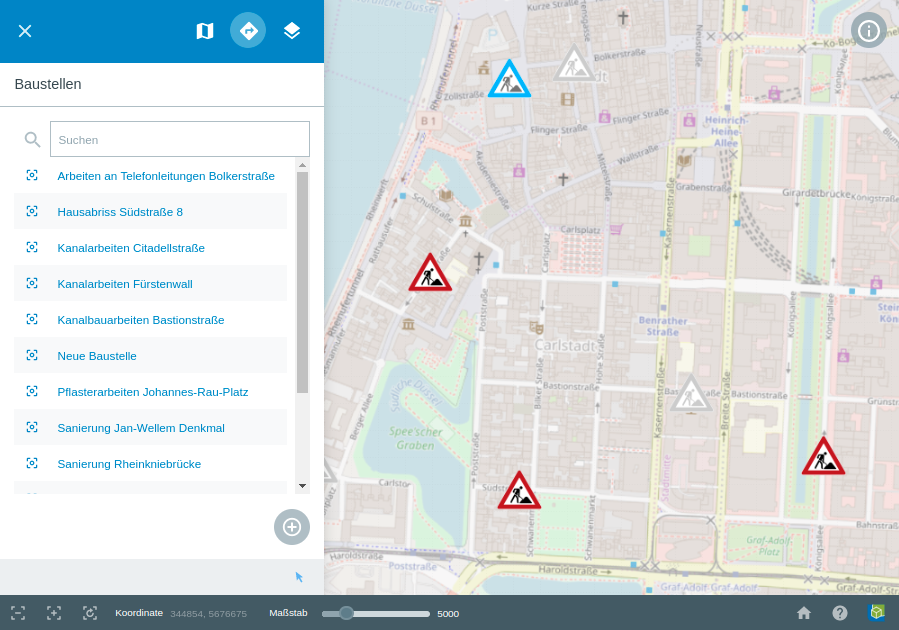
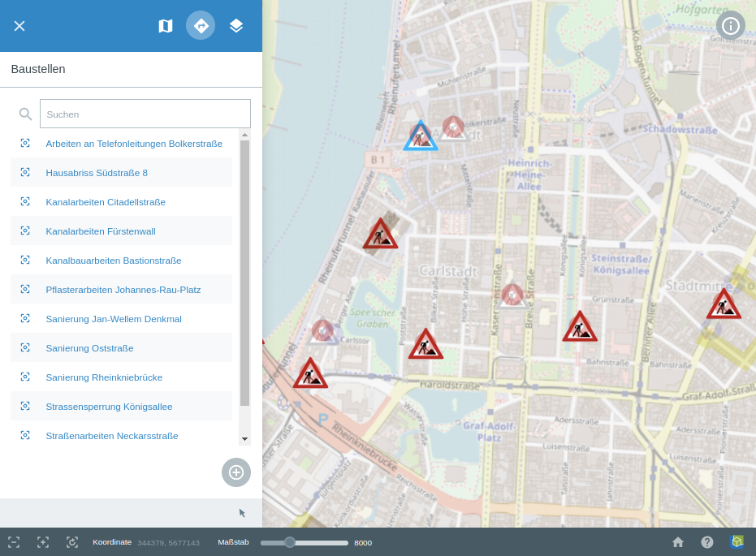
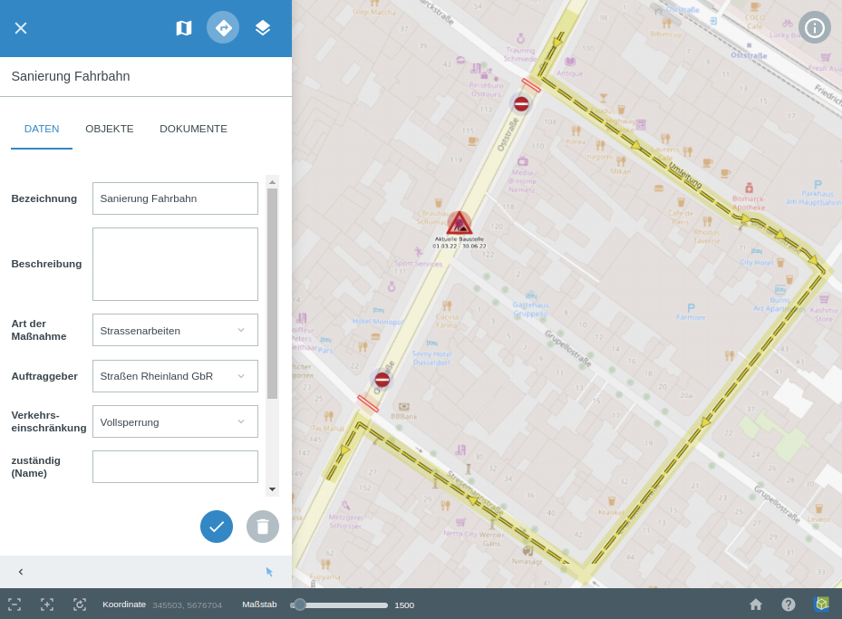
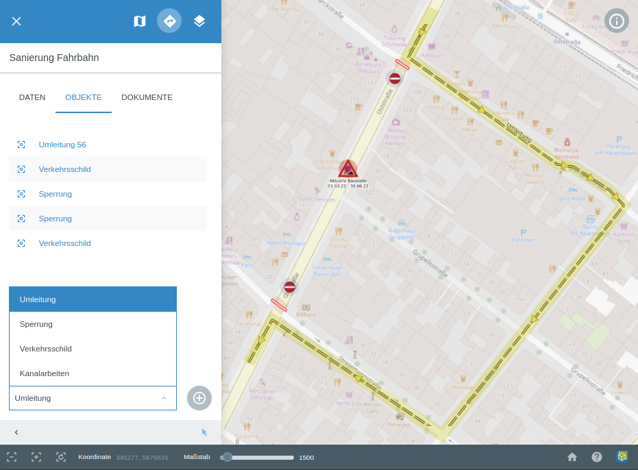
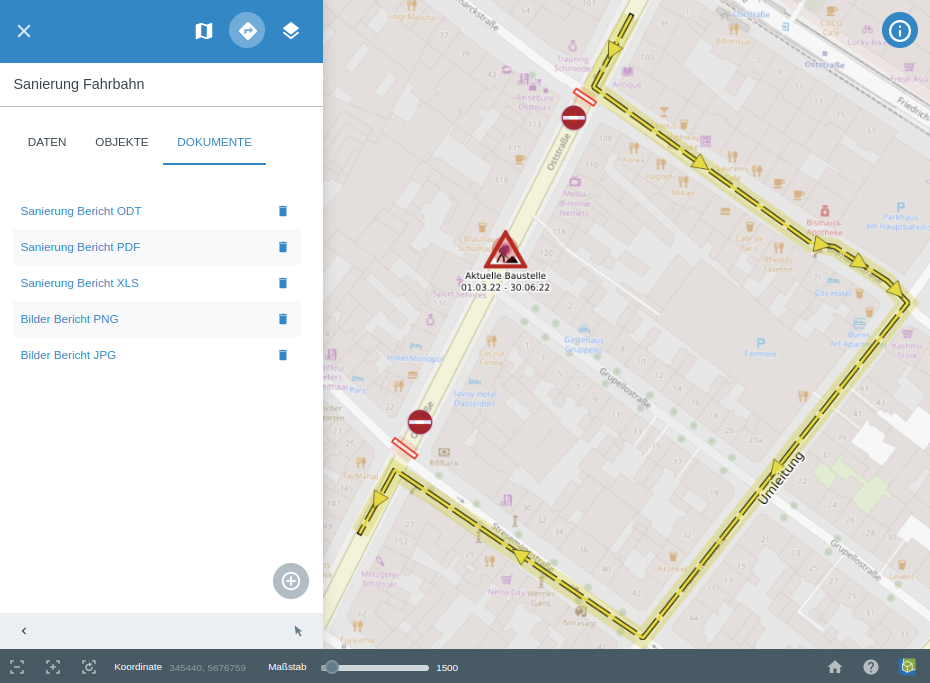

.. location_manager:

Location Manager
================

Der Location Manager ist ein universell verwendbares Modul. Es ermöglicht die Darstellung von temporären Ereignissen,
die aus den unterschiedlichsten Anwendungsfällen kommen können. Es ist sozusagen ein generisches Werkzeug, um temporäre Ereignisse darzustellen.
Für die gewünschten Ereignisse, können Attributformulare definiert werden. Wie in QGIS kann einzelnen Feldern des Attributformulars,
gewisse Funktionen oder Restriktionen vorgegeben werden. So kann zum Beispiel erzwungen werden, dass ohne Eintragen eines Werts für ein gewisses Feld,
das Abspeichern des neuen Objekts nicht möglich ist. Bereits vorhandene Objekte können später editiert werden.
Den Objekten können individuelle SVG Icons zugeordnet werden. Außerdem können geometrische Formen, mit eingebunden werden.
Diese werden in der Regel, für Zusatzinformationen benutzt und können individuell gestaltet werden. Eine datendefinierte Übersteuerung kann eingerichtet werden.
So können sich zum Beispiel die SVG Icons verändern, wenn ein Wert sich verändert oder ein Datum überschritten wurde.
Auch maßstabsabhängige Darstellungen können für Beschriftungen, sowie für geometrische Objekte eingestellt werden.
Diese Gestaltung der Darstellung findet durch den Administrator in QGIS statt.
Dabei stehen ihm sämtliche Gestaltungsmöglichkeiten für Symbolisierung, Darstellung und Beschriftung aus QGIS zur Verfügung.
Ein Beispiel bei dem dieses Modul verwendet wird, befindet sich auf unserer `Homepage <https://gbd-websuite.de/>`_.
Das Projekt "Baustellenverwaltung Düsseldorf" zeigt das Aufkommen von Baustellen in Düsseldorf.

Wenn die Berechtigung vorliegt, Daten zu editieren, kann das |location_manager| Location Manager Werkzeug genutzt werden.
Diese Berechtigung kann zum Beispiel, nur gewissen, beziehungsweise dazu verifizierten Nutzern zur Verfügung gestellt werden.
In diesem Beispiel können dann Baustellen eingetragen und editiert werden.
Wenn man das Werkzeug über die Menüleiste öffnet, findet man eine Übersicht über die vorhandenen Baustellen.

Über das Plus-Zeichen können neue Baustellen hinzugefügt werden.
Mit Hilfe des darunter liegenden Pfeils, können vorhandene Baustellen zum Editieren selektiert werden.
Außerdem können die Baustellen durch ein gedrückt halten der linken Maustaste verschoben werden.
Wenn eine Baustelle selektiert wird, öffnen sich automatisch die dazugehörigen Objekteigenschaften.

Hier stehen die Reiter ``Daten``, ``Objekte`` und ``Dokumente`` zur Auswahl.
Unter ``Daten`` kann ein Attributformular mit diversen Eingabefeldern definiert sein.
Vordefinierte Drop-Down Menüs erleichtern die Eingabe.
Es können Felder vorhanden sein, bei denen eine Eingabe zwingend erforderlich ist.
Ansonsten kann das Objekt nicht gespeichert werden.
In diesem Beispiel ist es zum Beispiel die Eingabe des Start- und Enddatum.
Hintergrund ist der, dass die Symbole der Baustellen, je nach Aktualität, unterschiedlich dargestellt.
In diesem Projekt wurden die Symbole so definiert,
dass nicht mehr vorhandene Baustellen, mit einem grauen Symbol, dargestellt werden.
Zukünftige Baustellen werden mit einem blauen Symbol dargestellt.
Alle Eintragungen unter ``Daten`` können jederzeit verändert werden.
Über |done| können Sie das Objekt abspeichern, über |delete_marking| können Sie das Objekt löschen.

Neben den Baustellen können weitere ``Objekte`` hinzugefügt werden.
Es können geometrische Objekte, Texte oder auch Links in dem Kartenfenster platziert werden.
Welche Objekte zur Verfügung stehen und wie diese dargestellt, beziehungsweise symbolisiert werden,
wird durch den Administrator definiert.Diese Konfiguration findet über ein QGIS Projekt statt,
wodurch dem Administrator sämtliche Gestaltungsmöglichkeiten zur Auswahl stehen.
In dem Beispiel Projekt stehen Punktobjekte in Form von Verkehrsschildern,
in Linienobjekte in Form von Sperrungen, Umleitungen und Kanalarbeiten zur Verfügung.

Maßstabsabhängige Darstellungen oder datendefinierte Übersteuerungen können ebenfalls,
aus den Funktionen von QGIS übernommen werden.
Wenn ein Objekttyp ausgewählt wurde, kann das Eintragen über |new| gestartet werden.
Jetzt können Sie die gewünschten Objekte in die Karte zeichnen.

Zusätzlich ist es möglich ``Dokumente`` abzuspeichern.
Diese stehen dann verifizierten Nutzern zum Download zur Verfügung.
Es können verschiedenste Dateitypen bereitgestellt werden.

.. |done| image:: ../../../images/baseline-done-24px.svg
  :width: 30em
.. |new| image:: ../../../images/sharp-control_point-24px.svg
  :width: 30em
.. |delete_marking| image:: ../../../images/sharp-delete_forever-24px.svg
  :width: 30em
