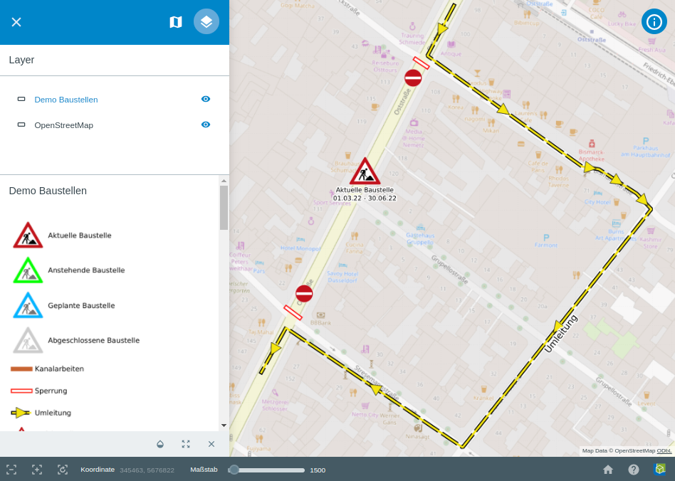

.. location_manager:

Location Manager
================

Das Location Manager Werkzeug ist ein universell verwendbares Werkzeug. Es ermöglicht die Darstellung von temporären Ereignissen,
die aus den unterschiedlichsten Anwendungsfällen kommen können. Es ist sozusagen ein generisches Werkzeug, um temporäre Ereignisse darzustellen.
Für die gewünschten Ereignisse, können Attributformulare definiert werden. Wie in QGIS kann einzelnen Feldern des Attributformulars,
gewisse Funktionen oder Restriktionen vorgegeben werden. So kann zum Beispiel erzwungen werden, dass ohne Eintragen eines Werts für ein gewisses Feld,
das Abspeichern des neuen Objekts nicht möglich ist. Bereits vorhandene Objekte können später editiert werden.
Den Objekten können individuelle SVG Icons zugeordnet werden. Außerdem können geometrische Formen, auf Wunsch, mit eingebunden werden.
Diese werden in der Regel, für Zusatzinformationen benutzt und können individuell gestaltet werden. Eine datendefinierte Übersteuerung kann eingerichtet werden.
So können sich zum Beispiel die SVG Icons verändern, wenn ein Wert sich verändert oder ein Datum überschritten wurde.
Auch maßstabsabhängige Darstellungen können für Beschriftungen, sowie für geometrische Objekte eingestellt werden.
Diese Gestaltung der Darstellung findet durch den Administrator in QGIS statt. Dabei stehen ihm sämtliche Gestaltungsmöglichkeiten aus QGIS zur Verfügung.
Ein Beispiel bei dem dieses Werkzeug verwendet wird, befindet sich auf unserer Homepage. Das Projekt "Baustellenverwaltung Düsseldorf" zeigt das Aufkommen von Baustellen in Düsseldorf.

Hier können Baustellen eingetragen werden und anhand eines Formulars, Eigenschaften und Informationen über diese eingetragen werden.
Außerdem können in diesem Beispiel Umleitungen, durch das Zeichnen von Linien, eingetragen werden. Der Stil dieser Linien kann beliebig definiert werden.
In diesem Beispiel sind die Linien gelb markiert, wie gewöhnlich für Umleitungen. Die Umleitungen haben eine maßstabsabhängige Darstellung.
Auf dem folgenden Bild wurde weiter hineingezoomt. Dadurch werden Umleitungen jetzt dargestellt.

