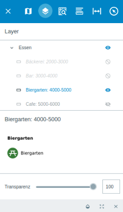

.. _map_element:

Layer
=====

In der Menüebene |layers| :guilabel:`Layer` findet man eine Auflistung der implementierten Layer und Layergruppen des Projekts.
Wenn die Zugriffsrechte vorhanden sind, ist das individuelle Implementieren und Konfigurieren von einzelnen Layern, sowie das Erstellen von Layergruppen in der GBD WebSuite möglich.
Dieses Konfigurieren findet über dazugehörige QGIS Projekte statt.
Anhand der Auflistung unter diesem Menüpunkt kann zusätzlich ein Überblick über die Sichtbarkeit der einzelnen Layer gewonnen werden.

Das Einblenden oder Ausblenden eines Layers oder einer Layergruppe, erfolgt über einen Klick auf |showlayer| ``Layersichtbarkeit ändern``.
Erscheint neben dem Layer das Icon |showlayer|, ist dieser sichtbar. Erscheint das Icon |hidelayer|, ist er nicht sichtbar.
Außerdem können maßstabsbezogene Darstellungen für Layer und Layergruppen in der Konfiguration der GBD WebSuite, vergeben werden.
Diese Layer werden nur dann dargestellt, wenn der Kartenmaßstab einem Wert für die maßstabsbezogene Darstellung entspricht.
Wenn dies nicht der Fall ist, wird der Layer nicht angezeigt und neben ihm erscheint das Symbol |scale_layer|.
Das Anpassen und Konfigurieren von Layern ist per QGIS möglich. Sämtliche Änderungen, die in dem verknüpften QGIS Projekt vorgenommen werden,
werden so in die GBD WebSuite hochgeladen.

Mit einem Klick auf den Layernamen öffnet man die Eigenschaften dieses Layers.
Hier können Legende, Metadaten sowie Copyright Einträge eingesehen werden.
Für alle Layertypen der GBD WebSuite können individuell erstellte Legenden eingebunden werden.
Im Bildformat bestehende Legenden können als PNG-Dateien eingebunden werden. Legenden neu zu erstellen und einzubinden ist im HTML-Format möglich.
Eine bereits durch QGIS bereitgestellte Legende kann bei Bedarf ausgeblendet oder in der GBD WebSuite Konfiguration nachträglich angepasst werden.

Unter den Layereigenschaften befinden sich drei Werkzeuge.
Für einzelne Layer oder Layergruppen kann über |transperency| die ``Transparenz`` eingestellt werden.
Der Grad der Transparenz kann über den Schieberegler, wie auch über das Eintragen eines Wertes gewählt werden.
Dies wirkt sich auf jedes Objekt dieses Layers unabhängig davon, ob es ein Punkt-, Linien- und Flächenlayern ist, aus.
Mit |zoom_layer| ``Auf den Layer zoomen`` ist es möglich, auf die Gesamtausdehnung des gewählten Layers zu zoomen.
Über |cancel| ``Layerlegende schließen`` kann die Layerlegende geschlossen werden.

.. note::
 Die Möglichkeiten an GBD WebSuite Konfigurationen im |layers| ``Layer``-Menü sind sehr umfangreich.
 Durch die Integration von QGIS in die GBD WebSuite kann z.B.
 die Layerstruktur aus einem oder mehreren QGIS Projekten mit anderen Datenquellen kombiniert, zusammengefasst und übernommen werden.
 Im Zusammenspiel mit dem Rechtemanagement ist es zusätzlich möglich, dass verschiedene Nutzer unterschiedliche Layer bereitgestelltbekommen.

 .. |menu| image:: ../../../images/baseline-menu-24px.svg
   :width: 30em
 .. |showlayer| image:: ../../../images/baseline-visibility-24px.svg
   :width: 30em
 .. |hidelayer| image:: ../../../images/baseline-visibility_off-24px.svg
   :width: 30em
 .. |layers| image:: ../../../images/baseline-layers-24px.svg
   :width: 30em
 .. |showother| image:: ../../../images/baseline-chevron_right-24px.svg
   :width: 30em
 .. |hideother| image:: ../../../images/baseline-expand_more-24px.svg
   :width: 30em
 .. |cancel| image:: ../../../images/baseline-close-24px.svg
   :width: 30em
 .. |zoom_layer| image:: ../../../images/baseline-zoom_out_map-24px.svg
   :width: 30em
 .. |off_layer| image:: ../../../images/sharp-layers_clear-24px.svg
   :width: 30em
 .. |edit_layer| image:: ../../../images/baseline-create-24px.svg
   :width: 30em
 .. |scale_layer| image:: ../../../images/block-24px.svg
   :width: 30em
 .. |transperency| image:: ../../../images/opacity-24px.svg
   :width: 30em

..  Die Unterebenen der Gruppen werden über den Pfeil links neben dem Gruppennamen geöffnet |showother| und können über |hideother| wieder geschlossen werden.
