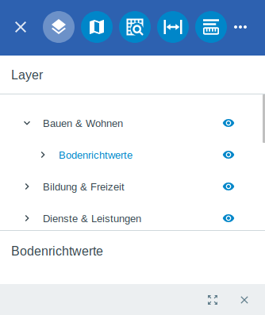

Kartenelemente
==============

Unter dem Menüpunkt |layers| ``Layer`` können Sie die Sichtbarkeit der einzelnen Layer ein- oder ausschalten. Der Umfang der Funktionen und die Sichtbarkeit der Layer können auf Wunsch individuell angepasst werden. Es ist zum Beispiel möglich, dass angemeldeten Nutzern mehr Layer zur Verfügung stehen als nicht angemeldeten Nutzern.

Die Layer sind in Projektgebieten oder anderen Überordnern gesammelt. Diese werden über den Pfeil links neben dem Layernamen geöffnet |showother| und können über das Icon |hideother| wieder geschlossen werden.
Das Ein- oder Ausschalten erfolgt über einen Klick auf das Augen-Symbol. Erscheint neben dem Layer das |showlayer| Symbol ist dieser sichtbar, erscheint das Symbol |hidelayer| ist er nicht sichtbar.

Man kann sowohl einzelne Teile der Layer ausblenden, wie auch ganze Überordner.
In manchen Karten werden bestimmte Layer erst ab einem entsprechenden Maßstab angezeigt, diese werden auch dann erst zur Layerauswahl hinzugefügt.

Mit einem Klick auf den Layernamen, öffnet sich unterhalb ein kleines Fenster, in dem bestimmte Informationen angezeigt werden können.
Unter den Informationen befinden sich zwei Werkzeuge, mit denen man auf den ausgewählten Layer zoomen kann |zoom_layer| oder die Layerdetails über das Icon |cancel| schließen.

 .. |menu| image:: ../../../images/baseline-menu-24px.svg
   :width: 30em
 .. |showlayer| image:: ../../../images/baseline-visibility-24px.svg
   :width: 30em
 .. |hidelayer| image:: ../../../images/baseline-visibility_off-24px.svg
   :width: 30em
 .. |layers| image:: ../../../images/baseline-layers-24px.svg
   :width: 30em
 .. |showother| image:: ../../../images/baseline-chevron_right-24px.svg
   :width: 30em
 .. |hideother| image:: ../../../images/baseline-expand_more-24px.svg
   :width: 30em
 .. |cancel| image:: ../../../images/baseline-close-24px.svg
   :width: 30em
 .. |zoom_layer| image:: ../../../images/baseline-zoom_out_map-24px.svg
   :width: 30em
 .. |off_layer| image:: ../../../images/sharp-layers_clear-24px.svg
   :width: 30em
 .. |edit_layer| image:: ../../../images/baseline-create-24px.svg
   :width: 30em
