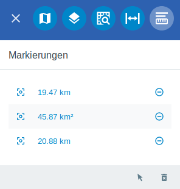
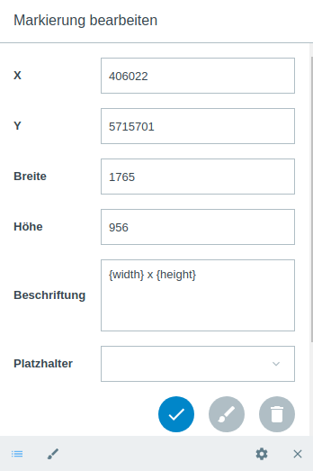

.. _markings:

Markierungen
============

Über die Menüleiste |menu| gelangt man zu dem Menüpunkt |marking| ``Markierungen``.
Die Objekte, die man mit Hilfe des :ref:`Markieren und Messen <measure>` - Werkzeuges erzeugt hat, werden hier aufgelistet.
Über |fokus| kann man zu dem gezeichneten Objekt hineinzoomen, über |delete| können Sie das gezeichnete Objekt direkt löschen.

Wenn ein Objekt neu gezeichnet oder im Menü ``Markierungen`` ausgewählt wurde, öffnet sich das jeweilige Objektfenster.
Hier können Geometrieeigenschaften abgelesen und Beschriftung eingetragen werden.
Unter dem Reiter ``Platzhalter`` befinden sich vorgefertigte Ausdrücke welche häufig zum Beschreiben von Geometrien verwendet werden.
Wenn keine Beschriftung eingetragen wird, werden Punkte, Linien und Flächen standardmäßig mit Koordinaten, Streckenlänge in Kilometer oder Fläche in Quadratkilometer beschriftet.
Falls dies auch nicht gewünscht ist, muss lediglich die Formel in dem Beschriftungsfenster gelöscht werden.

.. rubric:: Platzhalter für die Beschriftung

+------------------------+---------------------------------+
| **Feld**               | **Erläuterung**                 |
+------------------------+---------------------------------+
| {x}                    | gibt die X-Koordinate an        |
+------------------------+---------------------------------+
| {y}                    | gibt die Y-Koordinate an        |
+------------------------+---------------------------------+
| {widt}                 | gibt die Breite an              |
+------------------------+---------------------------------+
| {height}               | gibt die Höhe                   |
+------------------------+---------------------------------+
| {len}                  | gibt die Länge einer Linie an   |
+------------------------+---------------------------------+
| {area}                 | gibt die Fläche an              |
+------------------------+---------------------------------+
| {radius}               | gibt den Radius an              |
+------------------------+---------------------------------+

Für die Verwendung der Platzhalter wurde eine Formel entwickelt, wodurch die Einheit und die Präzision individuell bestimmt werden können.
Diese Formel besitzt folgende Form { |  | }. In den ersten Abschnitt wird der gewünschte Platzhalter eingetragen. In den zweiten Abschnitt wird die Einheit eingetragen.
Der letzte Abschnitt bestimmt die Präzision bzw wie viele Nachkommastellen vergeben werden sollen.

Hier ein paar Beispiele:

+----------------+------------------------------------------+
| {x | km | 2}   | x Position in Kilometer, 2 Dezimalstellen|
+----------------+------------------------------------------+
| {x | dms }     |x Position in Dezimalstellen              |
+----------------+------------------------------------------+
| {area | ha | 3}| Fläche in ha, 3 Dezimalstellen           |
+----------------+------------------------------------------+
| {area | km}    |Fläche in km2, 0 Dezimalstellen           |
+----------------+------------------------------------------+

.. rubric:: Darstellungskonfigurationen

Über den Punkt |style| ``Darstellung`` gelangt man zu den ausführlichen Darstellungsoptionen für |1| Geometrie und |2| Beschriftung.
Beide Darstellungen können über den jeweils obersten Menüpunkt, an- oder ausgeschaltet werden.
Bei den Geometrieoptionen kann der Stil der Linien, sowie die Füllung der Geometrie eingestellt werden.
Die Darstellungsoptionen für die Beschriftung bieten die beide Möglichkeiten.
Zusätzlich kann jedoch über die Menüpunkte ``Platzierung``, ``Ausrichtung`` und ``Versatz X/Y`` die Beschriftung positioniert werden.

.. figure:: ../../../screenshots/de/client-user/measure_combi.png
    :align: center

Mit Hilfe des Werkzeuges |select_marking| ``Bearbeiten`` können erstellte Markierungen in der Karte angewählt und danach bearbeitet werden.
Eine neue Markierung kann über das |new_marking| Icon angelegt werden oder über das ``Markieren und Messen`` Werkzeug selbst.
Das Laden |load| und Abspeichern |save| der gewählten Markierungen ist ebenfalls möglich.
Über das Werkzeug |delete_marking| ``Alle löschen`` werden alle Markierung auf einmal gelöscht.

.. note::
  Die Einheit der Markierung kann beliebig angepasst werden. Für weitere Informationen schauen Sie unter :ref:`Markieren & Messen <measure>` nach.
  All diese Funktionen können auf Wunsch auch deaktiviert oder nur gewissen Nutzern zur Verfügung gestellt werden.

 .. |menu| image:: ../../../images/baseline-menu-24px.svg
   :width: 30em
 .. |marking| image:: ../../../images/gbd-icon-markieren-messen-01.svg
   :width: 30em
 .. |select_marking| image:: ../../../images/cursor.svg
   :width: 30em
 .. |new_marking| image:: ../../../images/sharp-gesture-24px.svg
   :width: 30em
 .. |delete_marking| image:: ../../../images/sharp-delete_forever-24px.svg
   :width: 30em
 .. |delete| image:: ../../../images/sharp-remove_circle_outline-24px.svg
   :width: 30em
 .. |fokus| image:: ../../../images/sharp-center_focus_weak-24px.svg
   :width: 30em
 .. |save| image:: ../../../images/sharp-save-24px.svg
   :width: 30em
 .. |load| image:: ../../../images/gbd-icon-ablage-oeffnen-01.svg
   :width: 30em
 .. |measure| image:: ../../../images/gbd-icon-markieren-messen-01.svg
   :width: 30em
 .. |style| image:: ../../../images/brush.svg
   :width: 30em
 .. |point| image:: ../../../images/g_point.svg
   :width: 30em
 .. |quadrat| image:: ../../../images/g_box.svg
   :width: 30em
 .. |polygon| image:: ../../../images/g_poly.svg
   :width: 30em
 .. |distance| image:: ../../../images/dim_line.svg
   :width: 30em
 .. |cancel| image:: ../../../images/baseline-cancel-24px.svg
   :width: 30em
 .. |measurecircle| image:: ../../../images/dim_circle.svg
   :width: 30em
 .. |savedraw| image:: ../../../images/baseline-done-24px.svg
   :width: 30em
 .. |canceldraw| image:: ../../../images/baseline-cancel-24px.svg
   :width: 30em
 .. |back1| image:: ../../../images/double-arrow.svg
   :width: 30em
 .. |geo_search| image:: ../../../images/gbd-icon-raeumliche-suche-01.svg
   :width: 30em
 .. |1| image:: ../../../images/gws_digits-01.svg
   :width: 35em
 .. |2| image:: ../../../images/gws_digits-02.svg
   :width: 35em
