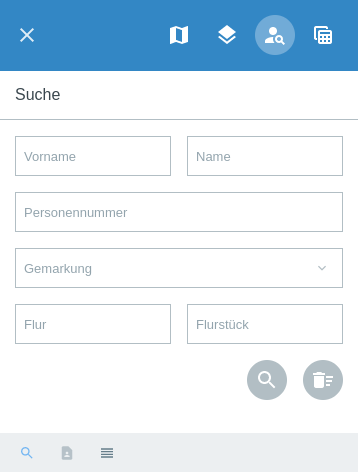
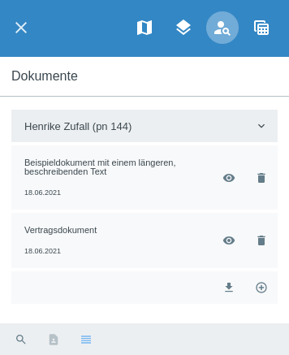

.. _person_info:

Personen Informationen
======================

Das |person_info| :guilabel:`Personen Informationen`-Modul dient dem Verwalten von personenbezogenen Informationen und Dokumenten.
Außerdem können diese Personeninformationen gewissen Layern oder Objekten zugeordnet werden, zum Beispiel einzelnen Flurstückflächen des Liegenschaftskatasters.
Es ist möglich, nach Personen, Personennummern und Flurstücken zu suchen und sich personenbezogene Daten und Dokumente anzeigen zu lassen.

Am unteren Menüfensterrand befinden sich eine Reihe von Funktionen für diesen Menüpunkt.
Über |search| ``Suche`` können Sie jederzeit zu der oben dargestellten Suche navigieren.
Über den Reiter |person| können Sie...
Außerdem können Dokumente über den Reiter |results| ``Dokumente`` eingesehen werden.

Wenn Sie die entsprechende Rechtevergabe besitzen, können Sie neue Dokumente hinzufügen.
Außerdem können bereits vorhandene Informationen geändert, heruntergeladen oder gelöscht werden.

 .. |results| image:: ../../../images/baseline-menu-24px.svg
   :width: 30em
 .. |search| image:: ../../../images/baseline-search-24px.svg
   :width: 30em
 .. |person_info| image:: ../../../images/person_search_black_24dp.svg
   :width: 30em
 .. |person| image:: ../../../images/person_black_24dp.svg
   :width: 30em
 .. |save| image:: ../../../images/sharp-save-24px.svg
   :width: 30em
 .. |cancel| image:: ../../../images/baseline-close-24px.svg
   :width: 30em
 .. |full_size| image:: ../../../images/crop_square_black_24dp.svg
   :width: 30em
