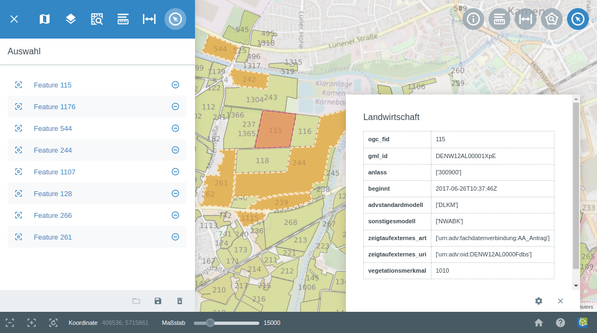

.. _select:

Auswahl
=======

Der Menüpunkt |select| ``Auswahl`` ist ein Ablagebereich für Objekte, die über das |select| :ref:`Auswählen <selecting>`-Werkzeug im Kartenfenster selektiert wurden.
Die Menüebene wird automatisch geöffnet, wenn das ``Auswählen``-Werkzeug aktiviert wird.

 .. figure:: ../../../screenshots/de/client-user/select1.png
   :align: center

Hier können Sie eine Übersicht, über die von Ihnen ausgewählten Objekte, gewinnen.
Alle angewählten und somit aufgelisteten Objekte werden orange markiert.
Diese Objekte können über |fokus| fokusiert werden oder über das |delete| Icon aus der Auswahl entfernt werden.
Wenn Sie den Titel eines Objektes anklicken, wird das Objekt rot markiert und es öffnet sich ein zusätzliches Informationsfenster.

In diesem Pop-Up Fenster können verschiedene Informationen über das angewählte Objekt abgelesen werden. Außerdem ist es möglich über |settings| weitere Funktionen auszuwählen.
Die Erklärung für die Funktionen :ref:`Markieren und Messen <measure>` und :ref:`Auswählen <selecting>` entnehmen Sie bitte dem jeweiligen Punkt, dieser Dokumentation.
Über |fokus| ``Hinzoomen`` fokusieren Sie das dazugehörige Objekt.

Am unteren Rand des Menüfensters befinden sich Funktionen zum Verwalten der Ablage.
Es ist möglich die Auswahl zu speichern |save| oder eine zuvor abgespeicherte Auswahl erneut zu laden |load|.
Über |delete_marking| können Sie die gesamte Auswahl löschen.

 .. |menu| image:: ../../../images/baseline-menu-24px.svg
   :width: 30em
 .. |select| image:: ../../../images/gbd-icon-auswahl-01.svg
   :width: 30em
 .. |delete| image:: ../../../images/sharp-remove_circle_outline-24px.svg
   :width: 30em
 .. |fokus| image:: ../../../images/sharp-center_focus_weak-24px.svg
   :width: 30em
 .. |save| image:: ../../../images/sharp-save-24px.svg
   :width: 30em
 .. |load| image:: ../../../images/gbd-icon-ablage-oeffnen-01.svg
   :width: 30em
 .. |delete_marking| image:: ../../../images/sharp-delete_forever-24px.svg
   :width: 30em
 .. |settings| image:: ../../../images/round-settings-24px.svg
   :width: 30em
