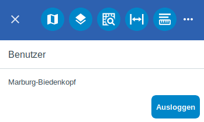

Anmeldung
=========

Die |authorization| ``Anmeldung`` ist ebenfalls über die |menu| Menüleiste zu erreichen. Diese Anmeldung kann per Json-Datei oder per LDAP konfiguriert werden.

.. note::
 Abhängig von Projekt und Benutzer, können individuell bestimmte Funktionen freigeschaltet werden. So ist es zum Beispiel möglich, verschiedene Informationen oder Funktionen für gewisse Nutzer frei zu geben und für andere nicht.

 .. |menu| image:: ../../../images/baseline-menu-24px.svg
   :width: 30em
 .. |authorization| image:: ../../../images/baseline-person-24px.svg
   :width: 30em
