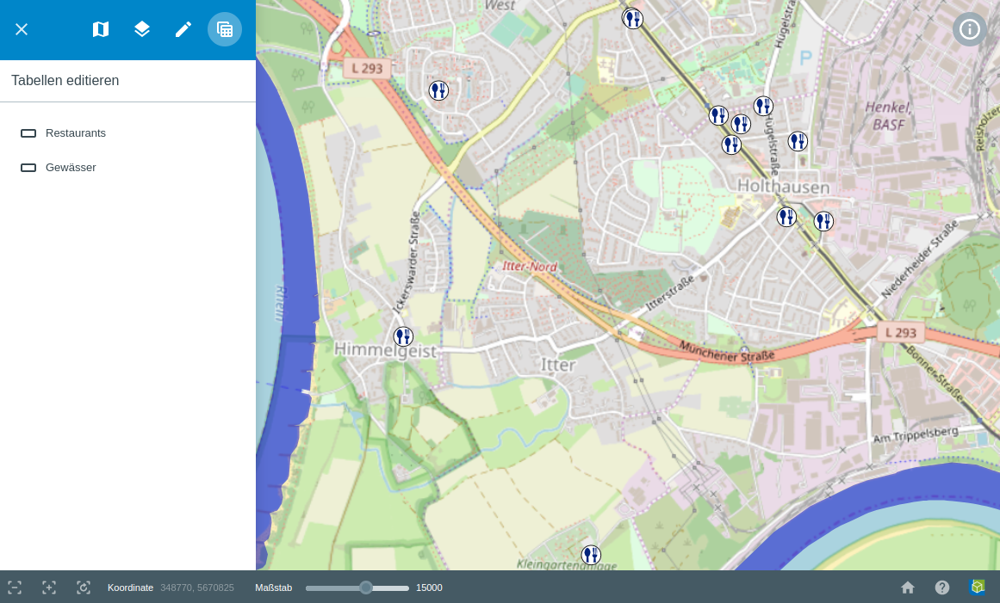
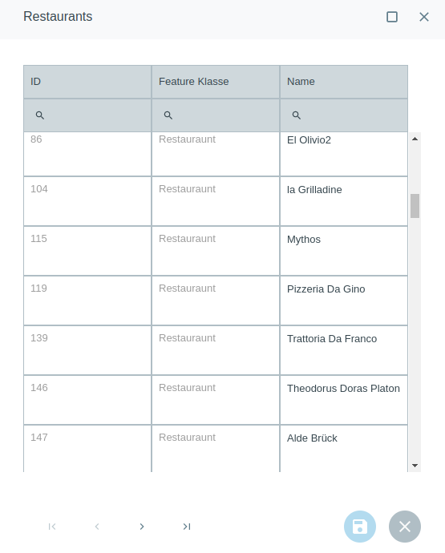

.. _table_editing:

Tabellen editieren
==================

Das |table_edit| ``Tabellen editieren``-Werkzeug bietet die Möglichkeit, Attributfelder in Attributtabellen zu editieren.

Beim Auswählen der Funktion, öffnet sich eine Liste mit den editierbaren Layern dieses GBD WebSuite Projekts.

Wenn Sie in der Liste einen dieser Layer Anklicken, öffnet sich eine Attributtabelle.

Hier können Sie in jeder Attributspalte über das obrige Suchfeld suchen.
Nach Spalten sortieren ist ebenfalls möglich. Außerdem können Sie Anpassungen oder Eintragungen in Attributfeldern vornehmen,
wenn die Attributspalte zum editieren freigegeben ist.
Über die Pfeiltasten am unteren Rand der Attributtabelle können Sie durch die einzelnen Seiten der Attributtabelle navigieren.
Durch ein Klicken auf |save|, speichern Sie die vorgenommenen Anpassungen. Durch ein Klicken auf |cancel|, wird die Attributtabelle ohne schließen gespeichert.
Zur besseren Übersicht, kann die Attributtabelle auch in Vollbild dargestellt werden. Klicken Sie dazu oben rechts auf |full_size|.

.. Über die Exportfunktion ist es außerdem möglich, die Attributtabelle in einer Datei lokal abzuspeichern.

 .. |table_edit| image:: ../../../images/table_view_black_24dp.svg
   :width: 30em
 .. |save| image:: ../../../images/sharp-save-24px.svg
     :width: 30em
 .. |cancel| image:: ../../../images/baseline-close-24px.svg
       :width: 30em
 .. |full_size| image:: ../../../images/crop_square_black_24dp.svg
     :width: 30em
