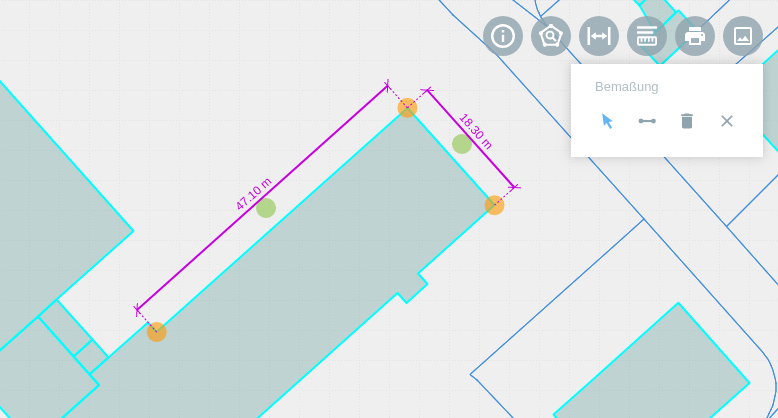

.. _dimensioning:

Bemaßung
========

Das |dimensions| ``Bemaßung``-Werkzeug ermöglicht die Erfassung von Streckenlängen, durch das Zeichnen von Linien. Ähnlich einer technischen Bemaßung.
Die gezeichneten Linien werden automatisch mit den jeweiligen Streckenlängen beschriftet.
Wenn Sie das Tool aktiviert haben, öffnet sich unter der Werkzeugleiste ein Feld mit verschiedenen Optionen.

.. figure:: ../../../screenshots/de/client-user/dimensions_tool.png
  :align: center

Über |arrow| können die gezeichneten Objekte verschoben und bearbeitet werden. Mit Hilfe der gelb markierten Stützpunkte |1| kann die Bemaßung versetzt werden.
Durch ein Klicken auf den grünen Hilfspunkt |2|, kann sowohl die Bemaßung als auch die Beschriftung auf der Linie verschoben werden.
Um ein Objekt zu zeichnen, ist dies über |line| möglich. Bei dem Zeichnen einer Linie, wird die Länge der einzelnen Strecken als Beschriftung angelegt.
Über |trash| kann die ausgewählte Strecke gelöscht werden. Das Tool schließen Sie per |cancel|.

.. note::
  Die Längeneinheit kann individuell angepasst werden.

 .. |dimensions| image:: ../../../images/gbd-icon-bemassung-02.svg
   :width: 30em
 .. |arrow| image:: ../../../images/cursor.svg
   :width: 30em
 .. |line| image:: ../../../images/dim_line.svg
   :width: 30em
 .. |cancel| image:: ../../../images/baseline-close-24px.svg
   :width: 30em
 .. |trash| image:: ../../../images/baseline-delete-24px.svg
   :width: 30em
 .. |1| image:: ../../../images/gws_digits-01.svg
   :width: 35em
 .. |2| image:: ../../../images/gws_digits-02.svg
   :width: 35em
