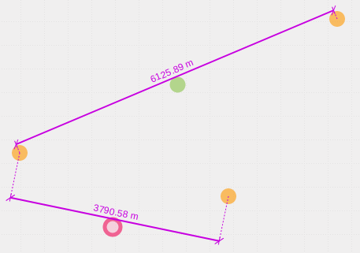

Bemaßung
========

Das |dimensions| ``Bemaßung``-Werkzeug ermöglicht die Erfassung von Streckenlängen durch das Zeichen von Linien. Die gezeichneten Linien werden automatisch mit den Streckenlängen beschriftet.Wenn Sie das Tool aktiviert haben, öffnet sich, unter der Werkzeugleiste, eine Leiste mit verschiedenen Symbolen.

.. figure:: ../../../screenshots/de/client-user/dimensions_tool.png
  :align: center

Über das |arrow| Icon können die gezeichneten Objekte verschoben und bearbeitet werden. Wenn man an den äußere Stützpunkten klickt kann diese verschieben wenn man auf den grünen Punkt in der Mitte klickt, kann die ganze Strecke verschobene werden. Über das |trash| Icon kann der Stützpunkt oder die gesamte Strecke gelöscht werden.

Um ein Objekt zu zeichnen muss das |line| Icon ausgewählt werden. Bei dem Zeichnen einer Linie wird die Länge der einzelnen Strecken als Beschriftung angelegt. Falls Sie das Tool schließen möchten ist dies über das |cancel| Icon möglich.

.. note::
 Wenn die Einheit anstatt Meter lieber in Kilometer oder ähnliches gewechselt werden soll, ist dies auf Wunsch realisierbar. Ebenso kann es aus dem Menü, prominent auf der Karte plaziert werden. Dies wäre zum Beispiel möglich nur für bestimmte Nutzer anzulegen. Wenn das ``Bemaßung``-Werkzeug generell nicht gewünscht ist, kann es aber auch entfernt bzw. deaktiviert werden.

 .. |dimensions| image:: ../../../images/gbd-icon-bemassung-02.svg
   :width: 30em
 .. |arrow| image:: ../../../images/cursor.svg
   :width: 30em
 .. |line| image:: ../../../images/dim_line.svg
   :width: 30em
 .. |cancel| image:: ../../../images/baseline-close-24px.svg
   :width: 30em
 .. |trash| image:: ../../../images/baseline-delete-24px.svg
   :width: 30em
