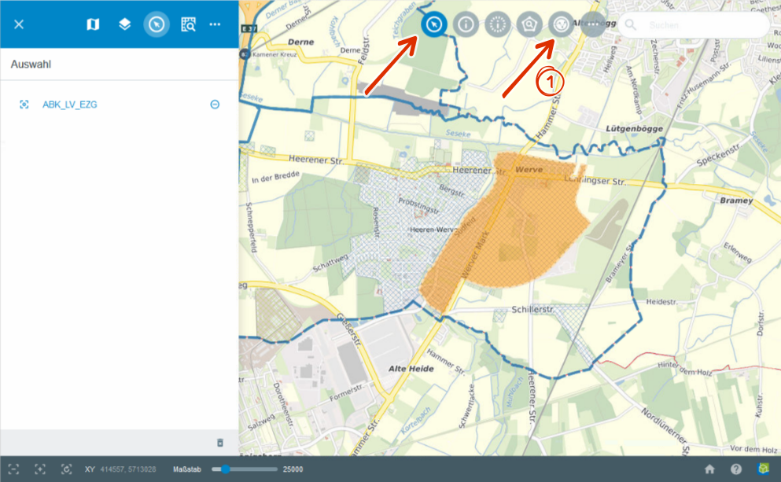
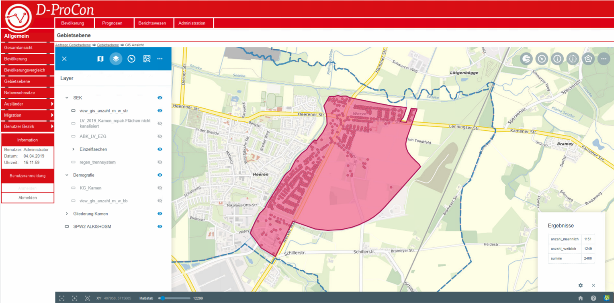
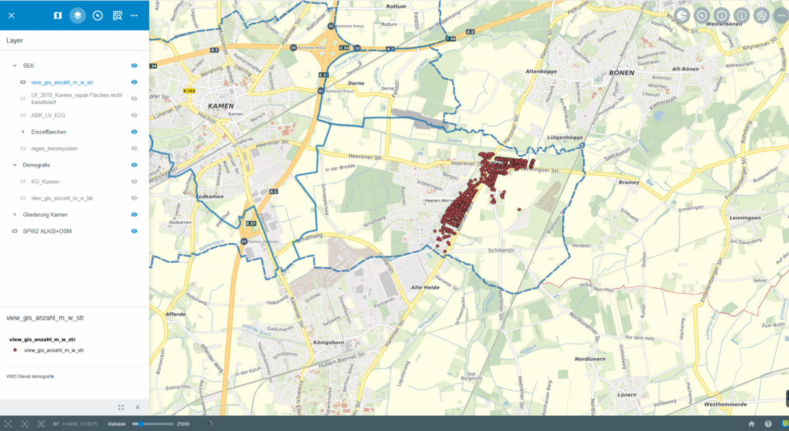

D-ProCon
========

Über das |dpro| ``D-Procon``-Werkzeug können statistische Analysen mit der proprietären Software D-ProCon durchgeführt werden.

Das ``D-Procon``-Werkzeug verarbeitet auf ALKIS basierte Adressdaten. Diese Adressdaten werden durch die Auswahl von Objekten selektiert. Sie können ein vorhandenes Objekt, wie zum Beispiel ein Flurstück oder einen Stadtteil über ``Auswählen`` sowie ein durch die ``Räumliche Suche`` selbst erstelltes Objekt für die Suche verwenden. Der GBD WebSuite Client ist direkt in D-ProCon integriert, was die Interaktion der Programme erheblich vereinfacht.

Zur Vereinfachung beschränken wir uns im untenstehenden Abschnitt auf das Arbeiten mit der Fachschale Demografie. Ziel ist das Erstellen von statistischen Prognosen, welche Informationen über die demografische Entwicklung bereit stellen.

Abrufen von Daten mit der GBD WebSuite
--------------------------------------

Voraussetzung für das Ergebnis ist die Vorauswahl der fachlichen Thematik in D-ProCon. Wählen Sie in der GBD WebSuite mithilfe des Tools |select| ``Auswählen`` ein Objekt, welches Sie für die Suche benutzen wollen. Oder definieren Sie mithilfe der |geo_search| ``Räumliche Suche`` ein eigenes Objekt für die Suche.

Starten Sie nun mit einem Klick auf das |dpro| ``D-Procon`` in der Werkzeugleiste die Suche |1|. Im Hintergrund findet nun ein Abgleich mit den bestehenden Daten in der D-ProCon-Datenbank statt. Die Fachdaten, innerhalb des zuvor ausgewählten Objektes werden Ihnen nun als Suchergebnis in D-ProCon direkt angezeigt. Über das Attributfenster erhalten Sie nähere Informationen zu den Suchergebnissen.

Zudem ist es möglich, die Fachdaten aus D-ProCon über QGIS dauerhaft in den Client der GBD WebSuite zu integrieren.

Ausführliche Informationen
--------------------------

Für ausführliche Informationen schauen Sie gerne auch unter: https://www.sisterhenn-it.de/d-procon-2/

.. note::
 Es kann auf Wunsch eingebunden oder ausgetragen werden, sowie an eine beliebige Stelle in der Werkzeugleiste plaziert werden.

 .. |dpro| image:: ../../../images/gbd-icon-d-procon-02.svg
   :width: 30em
 .. |geo_search| image:: ../../../images/gbd-icon-raeumliche-suche-01.svg
   :width: 30em
 .. |select| image:: ../../../images/gbd-icon-auswahl-01.svg
    :width: 30em
 .. |1| image:: ../../../images/gws_digits-01.svg
    :width: 35em
