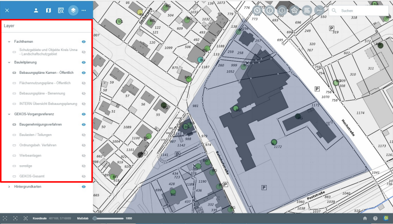
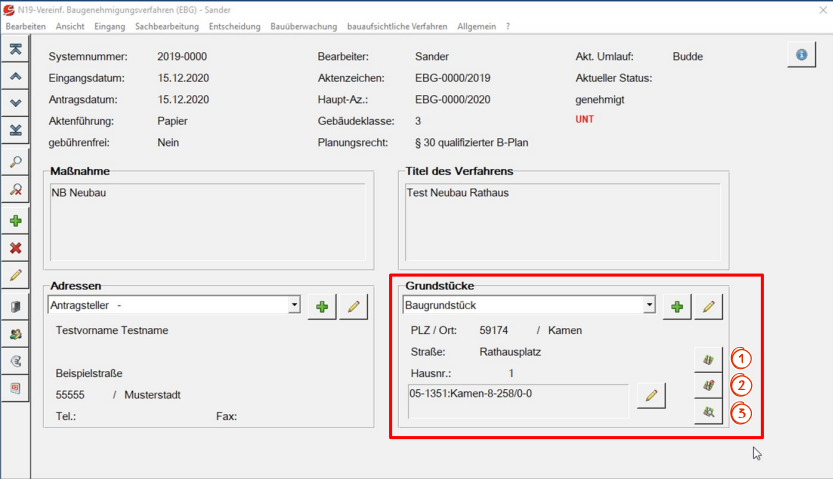
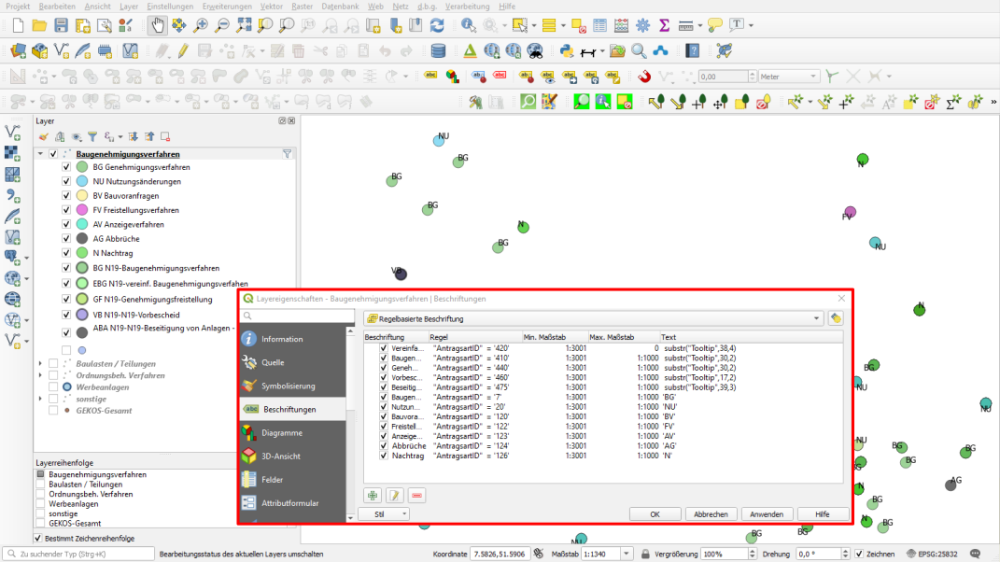

.. _gkos:

GeKoS
=====

**Funktion:**

GeKos ist ein Anbieter für kommunale Software Lösungen. Das |gkos| :guilabel:`GeKoS`-Werkzeug ist eine Schnittstelle zum Einbinden dieser externen Fachschale in die GBD WebSuite.
Falls Sie mit GeKoS zusammenarbeiten, können Sie mit Hilfe dieses Werkzeugs, Daten und Informationen einbinden, verwalten und weiterleiten.
Änderungen werden in der GBD WebSuite übernommen, sowie an die Gekos Software übermittelt.
Eingebundene Daten stehen Ihnen als eigene Layer zur Verfügung. In diesem Beispiel wurden via Gekos Baugenehmigungsverfahren eingebunden,
welche konkreten Flurstücken aus einem anderen Layer zugeordnet sind. Diese Baugenehmigungsverfahren können in der GBD WebSuite eingesehen und editiert werden.

**Bedienung:**

Die Ermittlung der Vorgangskoordinate ist eine gefragte Aufgabe bei diesen Verfahren. Hierzu wurden drei Icons mit Funktionen in die Gekos Maske eingebunden.

* |1| Über dieses Icon können Sie die Karte auf die vorhandene Vorgangskoordinate fokussieren.
  (Die Vorgangskoordinate wurde aus der Adresse des Grundstücks bzw. aus der Mittelpunktskoordinate des Flurstücks bei deren Eingabe automatisch im Hintergrund ermittelt).
* |2| Wenn Sie auf dieses Icon klicken, öffnet sich ein Fenster. Hier können Sie die Vorgangskoordinate manuell eingeben oder die Koordinate aus der Adresse selber ermitteln.
* |3| Über dieses Icon können Sie die Vorgangskoordinate in der Karte auswählen.

Die Symbolisierung und Beschriftung der Gekos Daten bzw. der Objekte eines Gekos Layers werden in QGIS konfiguriert.
Dabei stehen sämtliche QGIS Darstellungsoptionen zur Verfügung.

.. admonition:: Konfigurationsmöglichkeiten

 Die Suchfunktion der GBD WebSuite kann so eingerichtet werden, dass eine Suche die Attributwerte der Gekos Objekte mit einbezieht.
 So können Sie durch ein einziges Schlagwort einen Vorgang finden und sich anzeigen lassen.

 ..   .. figure:: ../../../screenshots/de/client-user/gkos3.png
    :align: center

Für zusätzliche Informationen schauen Sie gerne auch unter: https://www.gekos.de/

 .. |gkos| image:: ../../../images/gbd-icon-gekos-04.svg
   :width: 30em
 .. |1| image:: ../../../images/gws_digits-01.svg
   :width: 30em
 .. |2| image:: ../../../images/gws_digits-02.svg
   :width: 30em
 .. |3| image:: ../../../images/gws_digits-03.svg
   :width: 30em
