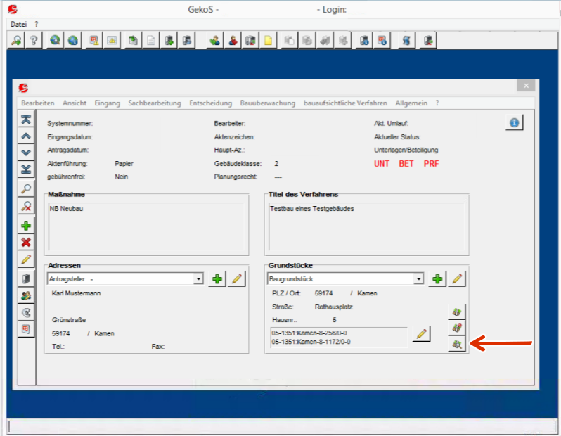
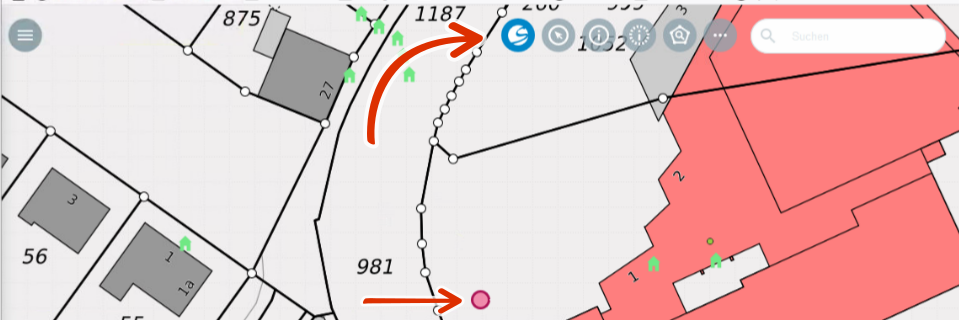
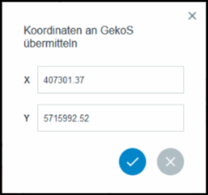

GeKoS
=====

Das |gkos| ``GeKoS``-Werkzeug in der Toolbar stellt eine Schnittstelle zur proprietären Software GeKoS - Software für Kommunen dar. Mithilfe von GeKoS werden verschiedene Verfahren verwaltet. Eine Übersicht zeigt die untenstehende Tabelle. Für eine vereinfachende Beschreibung beschränken wir uns untenstehend auf die Anwendung Baugenehmigung.

+------------------------------+-----------------------------------------------+
| **Fachschale**               | **Anwendung**                                 |
+------------------------------+-----------------------------------------------+
| GeKoS Bau+                   | Bauehmigung                                   |
+------------------------------+-----------------------------------------------+
| GeKoS Fahr+                  | Fahrerlaubnis                                 |
+------------------------------+-----------------------------------------------+
| GeKoS Brand+                 | vorbeugender Brandschutz                      |
+------------------------------+-----------------------------------------------+
| GeKoS Umwelt+                | Umweltschutz                                  |
+------------------------------+-----------------------------------------------+
| GeKoS Natur+                 | Naturschutz                                   |
+------------------------------+-----------------------------------------------+
| GeKoS BImSch+                | Immissionsschutz                              |
+------------------------------+-----------------------------------------------+
| GeKoS Online                 | E-Government                                  |
+------------------------------+-----------------------------------------------+

Aufrufen von Flurstücken im Client aus GeKoS
--------------------------------------------

Wählen Sie zunächst in GeKoS die Rubrik, worum es sich im aktuellen Fall handelt. Zum Beispiel Werbeanlagen, Vorbescheide, Baulasten, Baulastenberatung oder Baugenehmigung. Anschließend haben Sie die Möglichkeit ein oder mehrere Flurstück(e) per Flur-Zähler/Nenner oder mithilfe weiterer Suchkriterien zu selektieren. Über den Button ``Anzeigen im WebClient`` öffnet sich ein neuer Tab im Browser und die GBD WebSuite startet. Es wird automatisch auf Ihre Auswahl gezoomt. Zudem ist die Auswahl vorselektiert und kann im Attributfenster näher eingesehen werden.

Aufrufen von Flurstücken aus dem Client in GeKoS
------------------------------------------------

Ebenso kann der andere Weg gewählt werden. Navigieren Sie dazu in der GBD WebSuite zum gewünschten Kartenausschnitt. Wählen Sie anschließend das Icon |gkos| ``GeKoS`` in der Toolbar und klicken Sie auf das gewünschte Flurstück.

Nun öffnet sich ein Dialog, der Ihnen die Koordinaten zeigt, die an GeKoS übermittelt werden. Im Hintergrund findet nun ein Abgleich mit den bestehenden Flurstücken in der GeKoS-Datenbank statt. Das Flurstück, welches über die Koordinaten angesprochen werden kann, wird Ihnen als Suchergebnis in GeKoS direkt als Ergebnis angezeigt.

Ausführliche Informationen
--------------------------

Für ausführliche Informationen schauen Sie gerne auch unter: https://www.gekos.de/

 .. |gkos| image:: ../../../images/gbd-icon-gekos-04.svg
   :width: 30em
