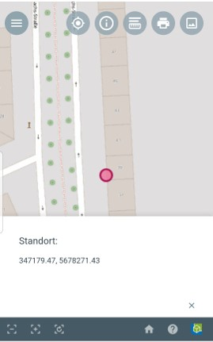

.. _location:

Mein Standort
=============

Mit der |location| ``Mein Standort``-Funktion können Sie Ihren aktuellen Standort ermitteln.

Wenn Sie das Bedienelement auswählen, zoomt die Karte zu Ihrem aktuellen Standort.
Mit der Genauigkeit von wenigen Metern wird ein Punkt in der Karte angezeigt, welcher Ihrer Position entspricht. Zusätzlich wird die Koordinate des Punktes angegeben.

.. tip::
 Falls Sie eine Fehlermeldung erhalten, kann dies verschiedene Gründe haben:

 Zum einen kann es sein, dass Ihre Standortdaten nicht verfügbar sind. Die Fehlermeldung lautet dann "Standortdaten sind nicht verfügbar". Voraussetzung ist das Ihr Gerät GPS-fähig ist,
 was heutzutage jedes mobile Endgerät ist. Wenn Sie jedoch von einem Computer arbeiten, funktioniert es in der Regel nicht.
 Falls ihr Gerät GPS besitzt und Sie trotzdem eine Fehlermeldung erhalten, kann es sein, dass Sie den Zugriff des Browsers auf die GPS-Koordinaten erst erlauben müssen.
 Zum anderen kann es sein, dass Sie die Fehlermeldung "Standort außerhalb der Kartenanzeige" erhalten. Das bedeutet, dass sich Ihr Standort außerhalb der Kartenanzeige befindet.
 Dies kann passieren, wenn in der WebSuite, sich nur ein kleiner Ausschnitt eines Gebietes befindet und Sie sich außerhalb befinden.

.. note::
 Es können diverse Geräte parallel eingebunden werden, sodass der Standort auch von mehreren Geräten angezeigt werden kann.
 Außerdem könnte eine Aufzeichnung der Bewegungen erstellt werden. So könnten zum Beispiel Tiere, welche mit GPS-Sendern markiert wurden, verfolgt und beobachtet werden.

 .. |location| image:: ../../../images/gps_fixed-24px.svg
   :width: 30em
