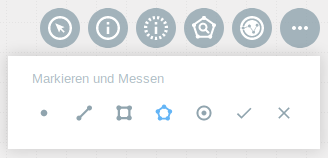

Markieren & Messen
==================

Nach dem Aktivieren des |measure| ``Markieren & Messen``-Werkzeuges, stehen fünf verschiedene Werkzeuge zur Verfügung:

**Punktmarkierung** |point|,
**Distanz-** |distance|,
**Rechteck-** |quadrat|,
**Polygon-** |polygon|,
und **Kreisflächenmessung** |measurecircle|

Die |point| **Punktmarkierung** dient lediglich dem Markierungszweck. Ein Messen ist hier nicht möglich. Aktivieren Sie das Werkzeug und klicken Sie mit der linken Maustaste auf einen Punkt in der Karte. Dieser wird standardmäßig mit der X- und Y-Koordinate beschriftet. Sie können die Beschriftung beliebig anpassen. Nutzen Sie dazu das sich automatisch öffnende Beschriftungsfeld in der Menüleiste.

Bei der |distance| **Distanzmessung** wird mit der linken Maustaste auf die Karte ein Startpunkt und mit jedem weiteren Klick ein weiterer Punkt gesetzt. Mit einem Doppelklick wird der Endpunkt gesetzt und die Länge der Strecke angezeigt.

Für die |quadrat| **Rechtecksflächenmessung** müssen zwei Punkte gesetzt werden. Erzeugen Sie den ersten Punkt mit der linken Maustaste. Ziehen Sie nun das Rechteck über die gewünschte Fläche in der Karte. Durch ein weiteres Klicken mit der linken Maustaste wird das Rechteck festgestellt. Nun öffnet sich automatisch wieder das Fenster in der Menüleiste. Hier kann jetzt neben der X- und Y-Koordinate auch die Breite und Höhe des gezeichneten Rechtecks abgelesen werden. Diese Werte dienen zur standardmäßigen Beschriftung. Über das Beschriftungsfeld kann der Text nach Belieben angepasst werden.

Bei der |polygon| **Polygonflächenmessung** kann durch das Setzen mehrerer Punkte ein Polygon gezeichnet werden. Starten Sie das Werkzeug und setzen Sie mit der linken Maustaste einen Startpunkt. Jetzt können beliebig viele Punkte hinzugefügt werden. Durch einen Doppelklick wird das Zeichnen beendet und das Polygon abgeschlossen. Die Beschriftung kann erneut über das dazugehörige Menüfenster vergeben werden. Falls nichts Individuelles gewählt wird, wird das Polygon mit der Flächengröße beschriftet.

Bei einer |measurecircle| **Kreisflächenmessung** wird zuerst ein Punkt mit einem Klick in die Karte gesetzt, dies ist der Kreismittelpunkt. Mit einem zweiten Klick um den Kreis, wird der Radius festgelegt. Es wird nun ein Kreis gezeichnet, welcher mit dem Radius in Metern beschriftet wird. Der Radius sowie die Beschriftung können nachträglich verändert werden. Hierzu nutzen Sie das entsprechende Feld in dem sich geöffneten Menüfenster.

.. note::
  Zu jedem Objekt stehen die bekannten Werkzeuge |fokus| ``Hinzoomen`` und |geo_search| ``Räumliche Suche`` zur Verfügung. Über die Symbole in der Werkzeugleiste können Sie die Zeichnung bestätigen |savedraw| oder abbrechen |canceldraw|. Außerdem kann jedes Objekt nachträglich angepasst werden. Wählen Sie dazu das Objekt im Menü ``Markierungen`` an. Nun können Sie neue Stützpunkt vergeben. Bei der Kreisflächenmessung kann der Radius angepasst werden. Mit |delete| kann man die erstellte Linie wieder löschen. Per |delete| kann das jeweilige Objekt gelöscht werden.

**Mögliche Felder für die Markierung**

+------------------------+---------------------------------+
| **Feld**               | **Erläuterung**                 |
+------------------------+---------------------------------+
| {len}                  | gibt die Länge einer Linie an   |
+------------------------+---------------------------------+
| {area}                 | gibt die Fläche an              |
+------------------------+---------------------------------+
| {radius}               | gibt den Radius an              |
+------------------------+---------------------------------+
| {x}                    | gibt die X-Koordinate an        |
+------------------------+---------------------------------+
| {y}                    | gibt die Y-Koordinate an        |
+------------------------+---------------------------------+
| {w}                    | gibt die Breite an              |
+------------------------+---------------------------------+
| {h}                    | gibt die Höhe                   |
+------------------------+---------------------------------+

.. note::
 Wie bei anderen Werkzeugen auch kann dieses Werkzeug individuell angepasst werden. Die Platzierung kann verändert werden, sowie es ebenfalls möglich wäre, zum Beispiel nur die Flächenmessung zu aktivieren. Falls die Messungen lieber in Kilometer oder ähnlichem erstellt werden sollen, kann auch dies angepasst werden.

 .. |measure| image:: ../../../images/gbd-icon-markieren-messen-01.svg
   :width: 30em
 .. |point| image:: ../../../images/g_point.svg
   :width: 30em
 .. |quadrat| image:: ../../../images/g_box.svg
   :width: 30em
 .. |polygon| image:: ../../../images/g_poly.svg
   :width: 30em
 .. |distance| image:: ../../../images/dim_line.svg
   :width: 30em
 .. |cancel| image:: ../../../images/baseline-cancel-24px.svg
   :width: 30em
 .. |measurecircle| image:: ../../../images/dim_circle.svg
   :width: 30em
 .. |savedraw| image:: ../../../images/baseline-done-24px.svg
   :width: 30em
 .. |canceldraw| image:: ../../../images/baseline-cancel-24px.svg
   :width: 30em
 .. |delete| image:: ../../../images/baseline-delete_sweep-24px.svg
   :width: 30em
 .. |back1| image:: ../../../images/double-arrow.svg
   :width: 30em
 .. |geo_search| image:: ../../../images/gbd-icon-raeumliche-suche-01.svg
   :width: 30em
 .. |fokus| image:: ../../../images/sharp-center_focus_weak-24px.svg
   :width: 30em
