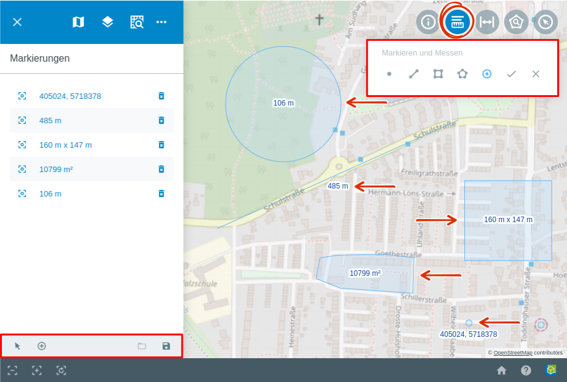

.. _measure:

Markieren & Messen
==================

**Funktion:**

Mit dem |measure| :guilabel:`Markieren & Messen`-Werkzeug ist es möglich, Positionen mit Punkten zu markieren, sowie Strecken und Flächen zu messen.

**Bedienung:**

Nach Aktivierung des Tools, öffnet sich unter der Werkzeugleiste ein Dialogfenster.
Hier kann eine Auswahl zwischen fünf verschiedenen geometrischen Formen getroffen werden:

Die |point| **Punktmarkierung** dient dem Markierungszweck. Ein Messen ist hier nicht möglich.
Aktivieren Sie das Werkzeug und klicken Sie mit der linken Maustaste auf den gewünschten Punkt in der Karte.
Sofort wird ein Punkt gesetzt, welcher standardmäßig mit X- und Y-Koordinate beschriftet wird.

Bei der |distance| **Distanzmessung** wird mit der linken Maustaste auf die Karte ein Startpunkt und mit jedem weiteren Klick ein weiterer Punkt gesetzt.
Mit einem Doppelklick wird der Endpunkt gesetzt und die Länge der Strecke angezeigt.

Für die |quadrat| **Rechtecksflächenmessung** müssen zwei Punkte gesetzt werden. Erzeugen Sie den ersten Punkt mit der linken Maustaste.
Ziehen Sie nun das Rechteck über die gewünschte Fläche in der Karte. Durch ein weiteres Klicken mit der linken Maustaste wird das Rechteck festgestellt.
Nun öffnet sich automatisch wieder das Fenster in der Menüleiste.
Hier kann jetzt neben der X- und Y-Koordinate auch die Breite und Höhe des gezeichneten Rechtecks abgelesen werden.
Diese Werte dienen zur standardmäßigen Beschriftung. Über das Beschriftungsfeld kann der Text nach Belieben angepasst werden.

Bei der |polygon| **Polygonflächenmessung** kann durch das Setzen mehrerer Punkte ein Polygon gezeichnet werden.
Starten Sie das Werkzeug und setzen Sie mit der linken Maustaste einen Startpunkt. Jetzt können beliebig viele Punkte hinzugefügt werden.
Durch einen Doppelklick wird das Zeichnen beendet und das Polygon abgeschlossen. Die Beschriftung kann erneut über das dazugehörige Menüfenster vergeben werden.
Falls nichts Individuelles gewählt wird, wird das Polygon mit der Flächengröße beschriftet.

Bei einer |measurecircle| **Kreisflächenmessung** wird zuerst ein Punkt mit einem Klick in die Karte gesetzt, dies ist der Kreismittelpunkt.
Mit einem zweiten Klick um den Kreis wird der Radius festgelegt. Es wird nun ein Kreis gezeichnet, welcher mit dem Radius in Metern beschriftet wird.
Der Radius sowie die Beschriftung können nachträglich verändert werden. Hierzu nutzen Sie das entsprechende Feld in dem sich geöffneten Menüfenster.

  .. * |point| :command:`Punktmarkierung`
  .. * |quadrat| :command:`Rechteckflächenmessung`
  .. * |polygon| :command:`Polygonflächenmessung`
  .. * |measurecircle| :command:`Kreisflächenmessung`

Alle erstellten Markierungen werden in der Ablage des Menüpunkts :ref:`Markierungen <markings>` aufgelistet.
Am unteren Menüfensterrand befinden sich folgende Funktionen für diesen Menüpunkt:

 * |arrow| Bearbeiten
 * |add| Bearbeiten
 * |load| Auswahl laden
 * |save| Auswahl speichern

Dieser Menüpunkt öffnet sich automatisch, wenn das |measure| :guilabel:`Markieren & Messen`-Werkzeug aktiviert wird.
Jedes Objekt kann nachträglich angepasst werden.
Wählen Sie dazu ein Objekt an und es öffnet sich automatisch das :guilabel:`Markierung bearbeiten` Dialogfenster mit den Objekteigenschaften.

.. figure:: ../../../screenshots/de/client-user/measure_info.png
  :align: center

**Geometrie Anpassungen**

Nun können Sie die Geometrie sowie die Beschriftung anpassen.
Die Geometrien können verändert werden, durch das verschieben oder neu erstllen von Stützpunkten im Kartenfenster.

**Beschriftung**

Die :command:`Beschriftung` kann individuell vergeben werden.
Bei jedem Objekt kann über den Reiter :command:`Platzhalter` frei gewählt werden, ob die Längen in Meter oder Kilometer angegeben werden.
Dabei ist die Eingabe von Werten mit Nachkommastellen möglich, welche je nach gewählter Einheit dann Zentimeter (cm) oder Meter(m) darstellen.

**Platzhalter**

+------------------------+---------------------------------+
| **Feld**               | **Erläuterung**                 |
+========================+=================================+
| {x}                    | gibt die X-Koordinate an        |
+------------------------+---------------------------------+
| {y}                    | gibt die Y-Koordinate an        |
+------------------------+---------------------------------+
| {widt}                 | gibt die Breite an              |
+------------------------+---------------------------------+
| {height}               | gibt die Höhe                   |
+------------------------+---------------------------------+
| {len}                  | gibt die Länge einer Linie an   |
+------------------------+---------------------------------+
| {area}                 | gibt die Fläche an              |
+------------------------+---------------------------------+
| {radius}               | gibt den Radius an              |
+------------------------+---------------------------------+

Für die Verwendung der Platzhalter wurde eine Formel entwickelt, wodurch die Einheit und die Präzision individuell bestimmt werden können.
Diese Formel besitzt folgende Form { |  | }. In den ersten Abschnitt wird der gewünschte Platzhalter eingetragen. In den zweiten Abschnitt wird die Einheit eingetragen.
Der letzte Abschnitt bestimmt die Präzision bzw. wie viele Nachkommastellen vergeben werden sollen.

**Beispiele**

+----------------+------------------------------------------+
| {x | km | 2}   | x Position in Kilometer, 2 Dezimalstellen|
+----------------+------------------------------------------+
| {x | dms }     |x Position in Dezimalstellen              |
+----------------+------------------------------------------+
| {area | ha | 3}| Fläche in ha, 3 Dezimalstellen           |
+----------------+------------------------------------------+
| {area | km}    |Fläche in km2, 0 Dezimalstellen           |
+----------------+------------------------------------------+

**Darstellung**

Über den Punkt |style| :guilabel:`Darstellung` gelangt man zu den ausführlichen Darstellungsoptionen für |1| Geometrie und |2| Beschriftung.
Beide Darstellungen können über den jeweils obersten Menüpunkt an- oder ausgeschaltet werden.
Bei den Geometrieoptionen kann der Stil der Linien, sowie die Füllung der Geometrie eingestellt werden.
Die Darstellungsoptionen für die Beschriftung bieten die gleichen Möglichkeiten.
Zusätzlich kann jedoch über die Menüpunkte :command:`Platzierung`, :command:`Ausrichtung` und :command:`Versatz X/Y` die Beschriftung positioniert werden.

.. figure:: ../../../screenshots/de/client-user/measure_combi.png
  :align: center

.. admonition:: Konfigurationsmöglichkeiten

 Wie andere Werkzeuge auch, kann dieses Werkzeug individuell konfiguriert werden.
 Die Platzierung kann verändert werden, sowie es ebenfalls möglich wäre, zum Beispiel nur die Flächenmessung zu aktivieren.

 .. |measure| image:: ../../../images/gbd-icon-markieren-messen-01.svg
   :width: 30em
 .. |style| image:: ../../../images/brush.svg
   :width: 30em
 .. |point| image:: ../../../images/g_point.svg
   :width: 30em
 .. |quadrat| image:: ../../../images/g_box.svg
   :width: 30em
 .. |polygon| image:: ../../../images/g_poly.svg
   :width: 30em
 .. |distance| image:: ../../../images/dim_line.svg
   :width: 30em
 .. |cancel| image:: ../../../images/baseline-cancel-24px.svg
   :width: 30em
 .. |measurecircle| image:: ../../../images/dim_circle.svg
   :width: 30em
 .. |savedraw| image:: ../../../images/baseline-done-24px.svg
   :width: 30em
 .. |canceldraw| image:: ../../../images/baseline-cancel-24px.svg
   :width: 30em
 .. |delete| image:: ../../../images/baseline-delete_sweep-24px.svg
   :width: 30em
 .. |back1| image:: ../../../images/double-arrow.svg
   :width: 30em
 .. |geo_search| image:: ../../../images/gbd-icon-raeumliche-suche-01.svg
   :width: 30em
 .. |fokus| image:: ../../../images/sharp-center_focus_weak-24px.svg
   :width: 30em
 .. |1| image:: ../../../images/gws_digits-01.svg
   :width: 35em
 .. |2| image:: ../../../images/gws_digits-02.svg
   :width: 35em
 .. |arrow| image:: ../../../images/cursor.svg
   :width: 30em
 .. |add| image:: ../../../images/sharp-control_point-24px.svg
   :width: 30em
 .. |save| image:: ../../../images/sharp-save-24px.svg
   :width: 30em
 .. |load| image:: ../../../images/ic_folder_open_24px.svg
   :width: 30em
