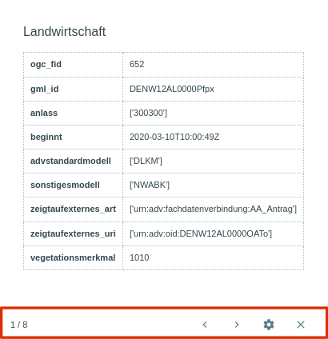

.. _object_identi:

Abfragen
========

Mit Hilfe des |info| :guilabel:`Abfragen`-Werkzeugs können Objekteigenschaften abgefragt werden.
Dazu werden Objekte markiert, von denen dann automatisch die Objekteigenschaften angezeigt werden.

**Bedienung:**

Markieren Sie mit der linken Maustaste ein Objekt im Kartenfenster.
Es öffnet sich ein Pop-up Fenster, in dem die Objekteigenschaften angezeigt werden.

.. figure:: ../../../screenshots/de/client-user/object_identification_11.png
  :align: center

Bei der Aktivierung des Tools können Sie eine Abfrage auf alle Objekte vornehmen.
Welche Objekte abgefragt werden können, wird im :ref:`Layer-Menü <map_element>` definiert.
Durch die Auswahl eines spezifischen Layers ist die Abfrage auf ausschließlich diesen Layer möglich.
Durch die Auswahl einer Layergruppe, ist die Abfrage auf alle Layer der Gruppe möglich.

Unter |options| :guilabel:`Aufgaben` stehen weitere Funktionen zur Verfügung:

+------------------------+------------------------------------------------------+----------------------------------------------------------+
| **Symbol**             | **Bedienelement**                                    |          **Kurzbeschreibung der Funktion**               |
+------------------------+------------------------------------------------------+----------------------------------------------------------+
|      |fokus|           |   :guilabel:`Hinzoomen`                              |:ref:`Zoomen zum gewählten Objekt <navigation>`           |
+------------------------+------------------------------------------------------+----------------------------------------------------------+
|     |measure|          |   :guilabel:`Markieren und Messen`                   |:ref:`Erstellen von Markierungen <measure>`               |
+------------------------+------------------------------------------------------+----------------------------------------------------------+
|    |select|            |   :guilabel:`Auswählen`                              |:ref:`Auswählen von Objekten <selecting>`                 |
+------------------------+------------------------------------------------------+----------------------------------------------------------+

.. admonition:: Konfigurationsmöglichkeiten

 * `GWS Abfragen Konfigurationen <https://gbd-websuite.de/doc/latest/books/server-admin/de/config/index.html>`_
 * `GWS Abfragen Konfigurationen <https://gbd-websuite.de/doc/latest/books/server-admin/de/config/index.html>`_
 * `GWS Abfragen Konfigurationen <https://gbd-websuite.de/doc/latest/books/server-admin/de/config/index.html>`_

 .. |info| image:: ../../../images/gbd-icon-abfrage-01.svg
   :width: 30em
 .. |layers| image:: ../../../images/baseline-layers-24px.svg
   :width: 30em
 .. |continue| image:: ../../../images/baseline-chevron_right-24px.svg
   :width: 30em
 .. |back| image:: ../../../images/baseline-keyboard_arrow_left-24px.svg
   :width: 30em
 .. |options| image:: ../../../images/round-settings-24px.svg
   :width: 30em
 .. |cancel| image:: ../../../images/baseline-close-24px.svg
   :width: 30em
 .. |measure| image:: ../../../images/gbd-icon-markieren-messen-01.svg
   :width: 30em
 .. |fokus| image:: ../../../images/sharp-center_focus_weak-24px.svg
   :width: 30em
 .. |select| image:: ../../../images/gbd-icon-auswahl-01.svg
   :width: 30em
