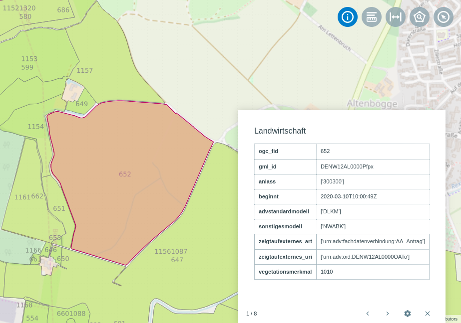

.. _object_identi_v2:

Abfragen (Version 2)
====================

Mit Hilfe des |info| :guilabel:`Abfragen`-Werkzeugs werden die Eigenschaften von markierten Objekten angezeigt.

Wählen Sie das Werkzeug in der Werkzeugleiste an.
Markieren Sie mit der linken Maustaste ein Objekt im Kartenfenster.
Es öffnet sich ein Pop-up Fenster, in dem die Objekteigenschaften angezeigt werden.
Durch eine vorherige Anwahl im :ref:`Layer <map_element>` Menü wird die mögliche Auswahl entsprechend auf diesen Layer beschränkt.
Durch die Auswahl eines spezifischen Layers ist die Abfrage auf ausschließlich diesen Layer möglich.
Durch die Auswahl einer Layergruppe, ist die Abfrage auf alle Layer der Gruppe möglich.

**Objekteigenschaften**

*  Mit |continue| und |back| blättern Sie durch die Objekteigenschaften der markierten Objekte.
*  Unter |options| stehen weitere Funktionen zur Verfügung: :ref:`Hinzoomen <navigation>`, :ref:`Markieren und Messen <measure>`, :ref:`Auswählen <selecting>`
*  Über |cancel| schließen Sie das Pop-up Fenster.

**Konfigurationsmöglichkeiten**

Hier könnten Informationen zu Konfigurationen stehen in einem Fließtext stehen.
Hier könnten Informationen zu Konfigurationen stehen in einem Fließtext stehen.

 .. |info| image:: ../../../images/gbd-icon-abfrage-01.svg
   :width: 30em
 .. |continue| image:: ../../../images/baseline-chevron_right-24px.svg
   :width: 30em
 .. |back| image:: ../../../images/baseline-keyboard_arrow_left-24px.svg
   :width: 30em
 .. |options| image:: ../../../images/round-settings-24px.svg
   :width: 30em
 .. |cancel| image:: ../../../images/baseline-close-24px.svg
   :width: 30em
