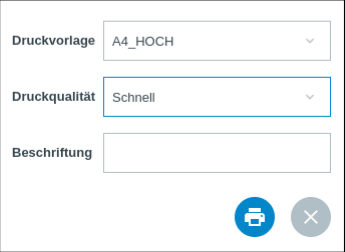
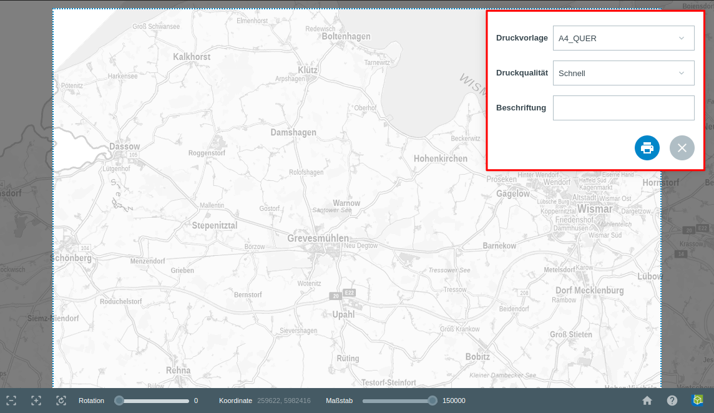

.. _print:

Drucken
=======

**Funktion:**

Mit Hilfe des |print| :guilabel:`Drucken`-Werkzeugs wird eine PDF generiert, die gespeichert und gedruckt werden kann.
Die GBD WebSuite kann in QGIS erstellte Druckvorlagen übernehmen und in Form einer Auswahl bereitstellen.
Es können als PNG oder HTML gespeicherte Legenden im Druck verwendet werden.
So kann man bei Layern der GBD WebSuite, welche keine eigenen Legenden besitzen, Legenden zur druckbaren Karte hinzufügen.
Auch Layer, die direkt über den WebSuite :ref:`Client <client>` eingebunden werden, können mit gedruckt werden.
Ein Implementieren in den WebSuite Server ist nicht notwendig.

**Bedienung:**

Beim Aktivieren der Druckfunktion wechselt die Ansicht der GBD WebSuite.
Im Kartenfenster öffnet sich ein Kartenrahmen mit dazugehörigem Dialogfenster.

* :command:`Druckvorlage:` und somit die Ausdehnung des Kartenrahmens konfigurieren.
* :command:`Druckqualität:` kann unterschiedlich bereitgestellt werden.
* :command:`Beschriftung:` können Sie einen Titel für den Druck vergeben.

.. admonition:: Konfigurationsmöglichkeiten

 Es ist möglich, dass vordefinierte Werte mit Titeln wie niedrig, mittel und hoch verknüpft sind, die dann zur Wahl stehen.
 Alternativ ist es auch möglich, dass über ein Schieberegler der DPI-Wert frei gewählt werden kann.
 In der Regel steht dann aber kein DPI-Wert von unter 70 DPI zur Verfügung, da sonst die Qualität des Drucks nicht gewährt wäre.

Der Kartenrahmen stellt den zu druckenden Ausschnitt dar und kann beliebig verschoben werden.
Über das Dialogfenster kann er konfiguriert werden.
Bei der Druckfunktion wird der aktuelle Kartenausschnitt mit seinen Inhalten unverändert übernommen.
Mit der linken Maustaste und dem Mausrad kann der gewünschte Ausschnitt und die Zoomstufe eingestellt werden.
Nach Wahl des gewünschten Ausschnitts, kann über das Drucksymbol |print| im Dialogfenster die druckfertige PDF generiert werden.
Dazu gehören: auf der Karte gezeichnete, beschriftete oder durch eine Abfrage markierte Objekte,
globale Einstellung wie die festgelegte :ref:`Rotation <turn>` und maßstabsbezogene Ebenendarstellungen,
sowie manuell festgelegte Transparenzen für einzelne Layer und Layergruppen.

.. |print| image:: ../../../images/baseline-print-24px.svg
    :width: 30em

.. können Sie über das Drucksymbol |print| den Export der druckfertigen PDF starten. Es öffnet sich ein Druckvorschaumodul. aHier wird Ihnen eine Vorschau des Drucks bereitgestellt. So kann der gewählte Ausschnitt nochmal kontrolliert werden.

 .. |print| image:: ../../../images/baseline-print-24px.svg
   :width: 30em
 .. |cancel| image:: ../../../images/baseline-cancel-24px.svg
   :width: 30em

.. .. figure:: ../../../screenshots/de/client-user/print_2.png
      :scale: 60%
      :align: center
