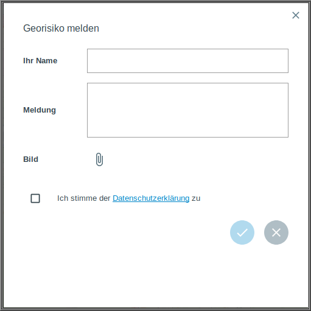

Georisiko melden
================

Das Werkzeug |select| ``Georisiko melden`` dient dem lokalisieren und aufzeigen von Georisiken. Wenn das Werkzeug aktiviert ist, kann der Ort wo das Georisiko vorliegt, in der Karte gewählt werden. Klicken Sie dazu nach Aktivierung auf die gewünschte Stelle in der Kartenanzeige. In dem sich nun öffneneden Fenster müssen einige Informationen eingetragen werden. Zuerst müssen Sie Ihren ``Namen`` eintragen, sodass die Meldung einer Person zugeordnet werden kann. Dann kann unter ``Meldung`` die Beschreibung des Georisikos eingetragen werden. Versuchen Sie hier möglichst genau das Georisiko zu erläutern. Zusätzlich zu der Meldung kann ein ``Bild`` hochgeladen werden, welches das Georisiko genauer visualisert. So kann das Georisiko in Worten und Bildern erläutert werden. Abschließend müssen Sie noch der Datenschutzerklärung zustimmen. Dann kann die Meldung, durch ein Klicken auf den Hacken abgeschickt werden. Nun kriegen alle anderen Nutzer dieses Geoportals eine Benachrichtigung und können sich diese Meldung anschauen.

.. note::
 Es wäre möglich, dass dieses Werkzeug nur in einem bestimmten Bereich der Karte genutzt werden kann. Auf Wunsch kann das ``Georisiko melden``-Werkzeug auch deaktiviert werden.

 .. |select| image:: ../../../images/gbd-icon-auswahl-01.svg
   :width: 30em
 .. |save| image:: ../../../images/sharp-save-24px.svg
     :width: 30em
 .. |load| image:: ../../../images/gbd-icon-ablage-oeffnen-01.svg
   :width: 30em
 .. |delete_marking| image:: ../../../images/sharp-delete_forever-24px.svg
     :width: 30em
