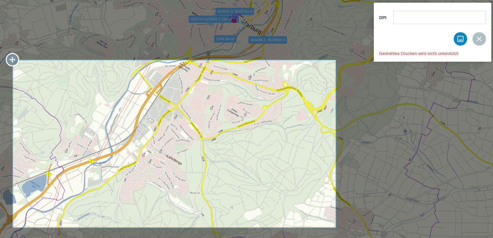

.. _screenshot:

Screenshot
==========

Bei Aktivierung des |screenshot| ``Screenshot``-Werkzeuges in der Werkzeugleiste, öffnet sich ein Rechteck auf der Karte.
Dieses kann frei navigiert werden. Beachten Sie jedoch, dass wenn das Rechteck über das Kartenfenster hinausgeht, diese Fläche in der exportierten Datei weiss dargestellt wird.
Wählen Sie den gewünschten Ausschnitt und vergeben Sie den DPI Wert.
Sie sollten am besten einen Wert zwischen 70 und 300 DPI auswählen um eine gute Auflösung zu erhalten.
Ein höherer DPI-Wert führt nur selten zu besseren Ergebnissen, allerdings wird die Dateigröße merklich größer.
Globale Einstellungen, wie die festgelegte :ref:`Rotation <turn>` und maßstabsbezogene Ebenendarstellungen, werden beim Screenshot genauso wie beim :ref:`Drucken <print>` übernommen.
Auch manuell festgelegte Transparenzen für einzelne Layer und Layergruppen werden übernommen.
Klicken Sie anschließend auf |screenshot|, um den Screenshot zu speichern. Alternativ können Sie über |cancel| den Vorgang abbrechen.

.. |screenshot| image:: ../../../images/outline-insert_photo-24px.svg
 :width: 30em
.. |cancel| image:: ../../../images/baseline-close-24px.svg
 :width: 30em
