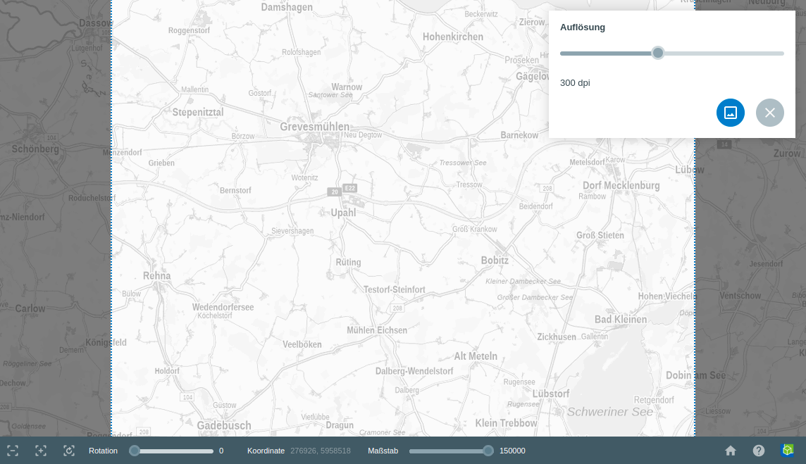

Screenshot
==========

Bei Aktivierung des |screenshot| ``Screenshot``-Werkzeuges öffnet sich ein Rechteck auf der Karte. Dieses kann durch verschieben der Karte beliebig platziert werden. Halten Sie dazu die linke Maustaste auf die Karte gedrückt und verschieben Sie diese so. Außerdem können Sie die Ausmaße des Screenshots über |navi| genauer bestimmen. Wählen Sie den gewünschten Ausschnitt, vergeben Sie den DPI Wert und klicken Sie auf |screenshot|.

Sie sollten am besten einen Wert zwischen 70 und 300 DPI auswählen um eine gute Auflösung zu erhalten. Klicken Sie anschließend wieder auf |screenshot| um den Screenshot zu speichern. Alternativ können Sie über |cancel| abbrechen.

.. .. figure:: ../../../screenshots/de/client-user/screenshot.png
  :scale: 60%
  :align: center

.. note::
 Beachten Sie, dass gedrehte Karten weder gedruckt, noch ein Screenshot von diesen gemacht werden kann.

 .. |screenshot| image:: ../../../images/outline-insert_photo-24px.svg
   :width: 30em
 .. |cancel| image:: ../../../images/baseline-close-24px.svg
   :width: 30em
 .. |navi| image:: ../../../images/Feather-core-move.svg
   :width: 30em
