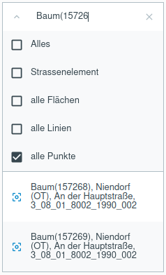

.. _searching:

Suchen
======
Durch die verschiedenen Konfigurationsmöglichkeiten der GBD WebSuite kann die |search| ``Suche`` in die Werkzeugleiste,
sowie in die Menüleiste als Menüpunkt :ref:`Suche <search>` integriert sein.
Die Möglichkeiten und Optionen dazu sind im "GBD WebSuite Server Administrator Handbuch" beschrieben.

Je nachdem ob Sie die Suche über die Menü- oder Werkzeugleiste aktivieren, öffnet sich auch eine Suchleiste an dazugehöriger Stelle.
In diese Suchleiste können Sie nun klicken und Ihren gesuchten Begriff eingeben.
Unterstützt wird die Suche durch Eingabe von Anfangsbuchstaben, freien Texten und Zahlenwerten.
Optional können Suchparameter definiert werden, welche unter dem Screenshot beschrieben werden.
Die integrierte Autocomplete-Funktion sorgt für eine dynamische Suche, sowie dafür dass Ihnen die Ergebnisse direkt angezeigt werden.
Wenn Sie die Suche über die Menüleiste öffnen, werden Ihnen die Ergebnisse im unterhalb der Werkzeugleiste angezeigt.
Durch ein Anklicken eines Ergebnisses, wird das dazugehörige Objekt automatisch im Kartenfenster fokussiert
und es öffnen sich die dazugehörigen Objekteigenschaften in einen Pop-up Fenster.

Die integrierte |search| ``Suche`` der GBD WebSuite kann unterschiedlich konfiguriert werden.
Die Suche kann Nominatim, sprich OSM-Daten, sowie Postgres-Datenbanken durchsuchen.
Bei der Nominatim-Suche werden die Objekteigenschaften von OSM-Objekten genutzt.
Bei der Suche in Postgres-Datenbanken, wird auf Informationen einzelner Spalten der Datenbank zugegriffen.

 .. |search| image:: ../../../images/baseline-search-24px.svg
   :width: 30em
