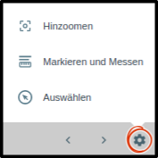

.. _selecting:

Auswählen
=========

Über das |select| :guilabel:`Auswählen`-Werkzeug werden Objekte in der Karte selektiert.

**Bedienung:**

Aktivieren Sie das Werkzeug, indem Sie auf |select| in der Werkzeugleiste klicken.
Durch ein Anklicken von Objekten werden diese selektiert. Die ausgewählten Objekte werden orange markiert.
Durch ein zweites Anklicken wird die Selektion aufgehoben.

.. figure:: ../../../screenshots/de/client-user/select1.png
  :align: center

Alle selektierten Objekte werden in der Ablage des Menüpunkts :ref:`Auswahl <select>` aufgelistet.
Dieser Menüpunkt öffnet sich automatisch, wenn das |select| :guilabel:`Auswählen`-Werkzeug aktiviert wird.
Am unteren Menüfensterrand befinden sich folgende Funktionen für diesen Menüpunkt:

.. table::
 :align: center

 +------------------------+------------------------------------------------------+
 | **Symbol**             | **Bedienelement**                                    |
 +------------------------+------------------------------------------------------+
 |      |load|            |   ``Auswahl laden``                                  |
 +------------------------+------------------------------------------------------+
 |     |save|             |   ``Auswahl speichern``                              |
 +------------------------+------------------------------------------------------+
 |    |delete_marking|    |   ``Auswahl löschen``                                |
 +------------------------+------------------------------------------------------+

Beim Anwählen eines Objekts in der Liste öffnet sich automatisch das Pop-up Fenster mit den Objekteigenschaften.
Unter |options| :guilabel:`Aufgaben` stehen weitere Funktionen zur Verfügung:

.. table::
 :align: center

 +------------------------+------------------------------------------------------+----------------------------------------------------------+
 | **Symbol**             | **Bedienelement**                                    |          **Kurzbeschreibung der Funktion**               |
 +------------------------+------------------------------------------------------+----------------------------------------------------------+
 |      |fokus|           |   :guilabel:`Hinzoomen`                              |:ref:`Zoomt zum gewählten Objekt <navigation>`            |
 +------------------------+------------------------------------------------------+----------------------------------------------------------+
 |     |measure|          |   :guilabel:`Markieren und Messen`                   |:ref:`Erstellen von Markierungen <measure>`               |
 +------------------------+------------------------------------------------------+----------------------------------------------------------+
 |    |select|            |   :guilabel:`Auswählen`                              |:ref:`Auswählen von Objekten <selecting>`                 |
 +------------------------+------------------------------------------------------+----------------------------------------------------------+

.. admonition:: Konfigurationsmöglichkeiten

 * `Auswählen-Werkzeug Konfigurationen <https://gbd-websuite.de/doc/latest/books/server-admin/de/config/index.html>`_

 .. |select| image:: ../../../images/gbd-icon-auswahl-01.svg
   :width: 30em
 .. |save| image:: ../../../images/sharp-save-24px.svg
     :width: 30em
 .. |load| image:: ../../../images/ic_folder_open_24px.svg
   :width: 30em
 .. |delete_marking| image:: ../../../images/sharp-delete_forever-24px.svg
     :width: 30em
 .. |measure| image:: ../../../images/gbd-icon-markieren-messen-01.svg
   :width: 30em
 .. |fokus| image:: ../../../images/sharp-center_focus_weak-24px.svg
   :width: 30em
 .. |options| image:: ../../../images/round-settings-24px.svg
   :width: 30em
