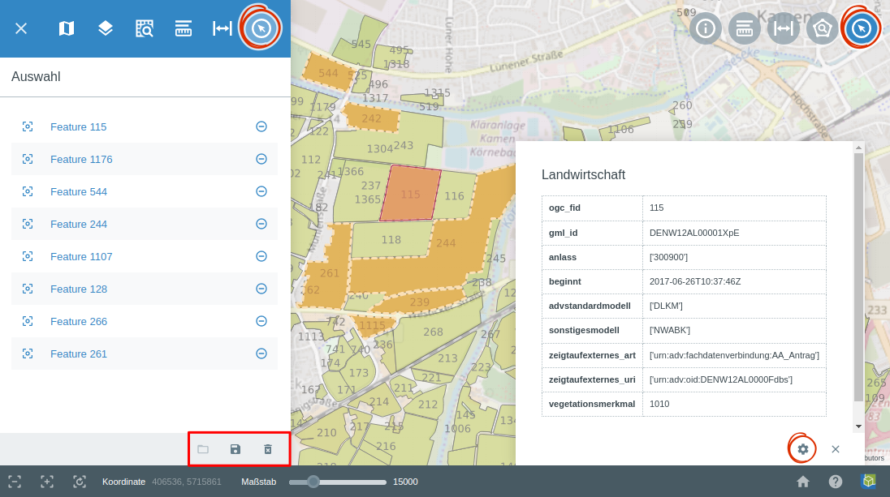

.. _selecting:

Auswählen
=========

Über das |select| ``Auswählen``-Werkzeug können Objekte in der Karte selektiert werden.
Aktivieren Sie das Werkzeug indem Sie auf |select| in der Werkzeugleiste klicken.
Jetzt können Sie Objekte anklicken und somit selektieren. Die ausgewählten Objekte werden orange markiert.
Wenn Sie ein Objekt ein zweits mal Anklicken, wird die Selektion aufgehoben.

Alle selektierten Objekte, werden in der Ablage des Menüpunkts :ref:`Auswahl <select>` aufgelistet.
Dieser Menüpunkt öffnet sich automatisch, wenn das ``Auswählen``-Werkzeug aktiviert wird.

Am unteren Menüfensterrand befinden sich eine Reihe von Funktionen für diesen Menüpunkt.
Zum einen ist es möglich, die Auswahl zu speichern |save|, eine zuvor abgespeicherte Auswahl erneut zu laden |load|, sowie die Auswahl zu löschen |delete_marking|.

.. note::
 Es wäre möglich dieses Werkzeug so zu konfigurieren, dass nur Objekte von gewissen Layern oder nur gewisse Geometrietypen ausgewählt werden können.

 .. |select| image:: ../../../images/gbd-icon-auswahl-01.svg
   :width: 30em
 .. |save| image:: ../../../images/sharp-save-24px.svg
     :width: 30em
 .. |load| image:: ../../../images/gbd-icon-ablage-oeffnen-01.svg
   :width: 30em
 .. |delete_marking| image:: ../../../images/sharp-delete_forever-24px.svg
     :width: 30em
