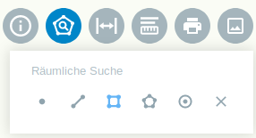
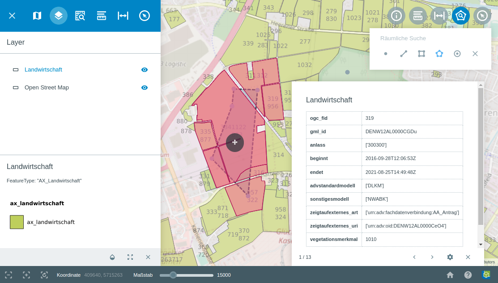

.. _searching:

Räumliche Suche
===============

Das Werkzeug |geo_search| ``Räumliche Suche`` ermöglicht die Erstellung geometrischer Formen mit Hilfe derer, verschiedene Objekte ausgewählt werden können.
Es ist möglich Punkte, Linien, Polygone oder Kreise zu erstellen. Diese können beliebig auf der Karte verschoben werden, um so verschiedene Objekte zu selektieren.
Welche Objekte ausgewählt werden, definiert man unter dem Menüpunkt ``Layer``. Nur die Objekte aus dem gewählten Layer oder der Layergruppe werden selektiert.

Über |geo_search| in der Werkzeugleiste kann das ``Räumliche Suche``-Werkzeug aktiviert werden.
Wählen Sie Ihre gewünschte Geometrie aus mit der die räumliche Suche erfolgen soll.

Durch einen Klick in die Karte mit der linken Maustaste, starten Sie das Zeichnen der Geometrie. Mit einem Doppelklick beenden Sie die Erstellung der Geometrie.
Eine nachträgliche Anpassung der Position und der Ausmaße der Geometrie ist möglich.
Durch ein Anklicken und gedrückt halten der linken Maustaste auf |navi| innerhalb der Geometrie, kann die Position der Geometrie angepasst werden.
Durch ein Anklicken eines Stützpunktes und dann gedrückt halten der linken Maustaste, kann dieser verschoben werden.
Durch einen Klick auf |cancel| wird das Werkzeug beendet.

.. note::
 Die räumliche Suche kann auf Wunsch deaktiviert oder wo anders angeordnet werden. Einzelne Funktionen wie die Suche per Punkt, Linie, Rechteck, Fläche oder Kreis können seperat aktiviert oder deaktiviert werden.

 .. |geo_search| image:: ../../../images/gbd-icon-raeumliche-suche-01.svg
   :width: 30em
 .. |edit| image:: ../../../images/sharp-edit-24px.svg
   :width: 30em
 .. |navi| image:: ../../../images/Feather-core-move.svg
   :width: 30em
 .. |cancel| image:: ../../../images/baseline-close-24px.svg
   :width: 30em
