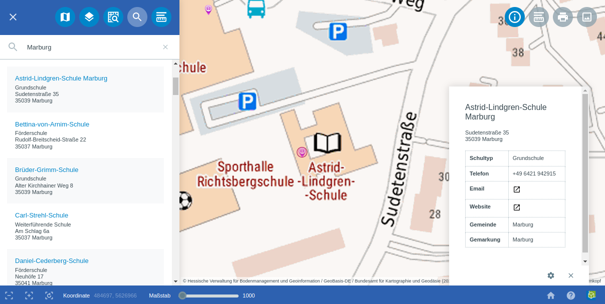

Suche
=====

Des Weiteren gelangt man anhand der Menüleiste |menu| zur |search| ``Suche``.
Hier besteht die Möglichkeit, basierend auf Daten oder per Nominatim eine Suche durchzuführen. Die Suche basierend auf Daten bezieht sich auf die integrierten Objekte und deren Attribute.
So ist es zum Beispiel möglich, nach Namen von Straßen, Schulen, Krankenhäusern, Geschäften und ähnlichem zu suchen. Geben Sie hierfür lediglich den Begriff "Schule" ein und die Suche listet Ihnen alle Schulen auf.
Außerdem werden auch sonstige Objekte, welche den Begriff beinhalten, aufgelistet.

.. note::
 Wenn gewünscht kann die Suche deaktiviert werden. Außerdem ist es möglich, dass die Suche anstatt in der Menüleiste, prominent auf der Karte zu sehen ist. Optional können Suchparameter definiert werden.

 .. |menu| image:: ../../../images/baseline-menu-24px.svg
   :width: 30em
 .. |search| image:: ../../../images/baseline-search-24px.svg
   :width: 30em
