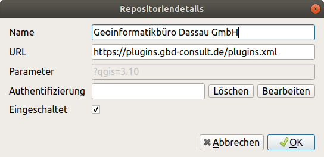
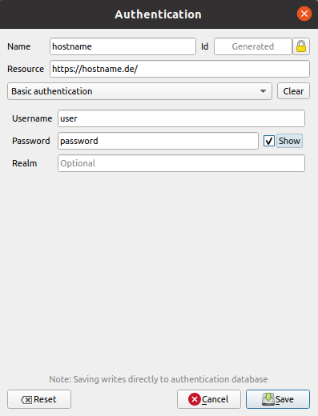
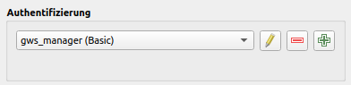
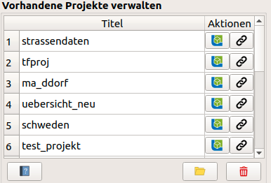

GBD WebSuite Manager Benutzerhandbuch
=====================================

Benutzerhandbuch für das GBD WebSuite Manager Plugin

Übersicht
---------

Das |gws| GBD WebSuite Manager Plugin ist eine Erweiterung die in QGIS installiert werden kann. Es ermöglicht die einfache Bereitstellung von QGIS Projekten in der GBD WebSuite. Voraussetzung ist, dass ein Nutzeraccount zu einer GBD WebSuite vorhanden ist, und dass deren GBD WebSuite Manager Schnittstelle aktiv ist.

.. figure:: screenshots/uebersicht_f.png
   :align: center

Installation
------------

Es gibt zwei Möglichkeiten, das Plugin in QGIS zu installieren. Zum einen können Sie es von unserem `Plugin Repository <https://plugins.gbd-consult.de/>`_ herunterladen und als ZIP-Datei in QGIS einbinden.

Zum anderen ist eine direkte Einbindung unseres Plugin-Repositorys in QGIS über folgenden Link möglich:

Wenn das Plugin installiert ist, ist es in QGIS unter Web -> GBD WebSuite -> GBD WebSuite Manager zu finden.
Alternativ kann es in den Werkzeugkästen ausgewählt und somit prominent in die Werkzeugleiste integriert werden.
Die einzelnen Funktionen werden im jeweiligen Menüpunkt genauer erklärt.

Anmelden
--------

Um das GBD WebSuite Plugin nutzen zu können muss man sich auf einem GBD WebSuite Server, mit aktivierter GBD WebSuite Manager Schnittstelle, authentifizieren.
Für diese Authentifizierung wird das QGIS eigene Authentifizierungssystem genutz.

Zuerst, falls noch nicht vorhanden, muss unter ``Einstellungen -> Optionen -> Authentifizierung`` ein Hauptpasswort gesetzt werden. Danach kann man über ``Neue Authentifizierungskonfiguration hinzufügen`` eine neue Verbindungen erstellen. Für eine Verbindung muss ein Name, Nutzername, Passwort und Serveradresse gesetzt werden, wobei Nutzername, Passwort und Serveradresse den Daten der GBD WebSuite Installation entsprechen müssen.

Die Authentifizierung sollte nun unter dem Drop Down Menü auswählbar sein und, bei Auswahl, automatisch eine Verbindung zur GBD WebSuite herstellen.
Sollten mehrere GBD WebSuite Installationen vorhanden sein, können auch mehrere Authentifizierungen hinterlegt werden, und zwischen diesen gewechselt werden.

Das Plugin prüft automatisch die Authentifizierung und stellt, bei Erfolg, das Plugin auf aktiv und läd die vorhandenen Projekte.

.. note::

  Weitere Informationen bezüglich des QGIS Authentifizierungssystems erhalten Sie in der `QGIS Dokumentation <https://docs.qgis.org/3.16/de/docs/user_manual/auth_system/index.html>`.

Aktuelles Projekt
-----------------

Hier können Sie ihr aktuelles QGIS Projekt in die GBD WebSuite hochladen.
Es werden sämtliche Vektorlayer und Dienste mit implementiert.

.. figure:: screenshots/selected_project_no_options.png
  :align: center

Tragen Sie den gewünschten Titel ein, der in die GBD WebSuite übernommen werden soll.
Wenn alles angepasst ist, muss man nur noch auf |add| ``Aktuelles Projekt hinzufügen`` klicken und das Projekt wird direkt in die GBD WebSuite hochgeladen.

Vorhandene Projekte verwalten
-----------------------------

Anhand dieser Liste kann man eine Übersicht über die hochgeladenen Projekte gewinnen.
Das gewählte Projekt kann man über |gws| ``Öffne die WebSuite`` sich in der WebSuite anzeigen lassen.
Über |link| ``Link anzeigen`` kann man sich den Projektlink anzeigen lassen.

Drei Werkzeuge am unteren Rand.
Über |help| ``Hilfe`` gelangt man zur ausführlichen Hilfe und Dokumentation.
Durch Klicken des Button |open| ``ausgewähltes Projekt anzeigen`` öffnet man das gewählte Projekt lokal in QGIS.
Mit Hilfe des |trash| Button kann das gewählte Projekt vom Server gelöscht werden.

.. |browse| image:: images/more_horiz-24px.svg
  :width: 30em
.. |gws| image:: images/gws_logo.svg
  :width: 30em
.. |add| image:: images/mActionAdd.svg
  :width: 30em
.. |options| image:: images/options.png
  :width: 2em
.. |link| image:: images/link.svg
  :width: 30em
.. |trash| image:: images/mActionTrash.png
  :width: 2em
.. |help| image:: images/mActionHelpContents.png
  :width: 2em
.. |open| image:: images/mActionFileOpen.png
  :width: 2em

.. .. toctree::
..     :maxdepth: 1

..   functions.rst
..   login.rst
..   edit_project.rst
..   manage_projects.rst
