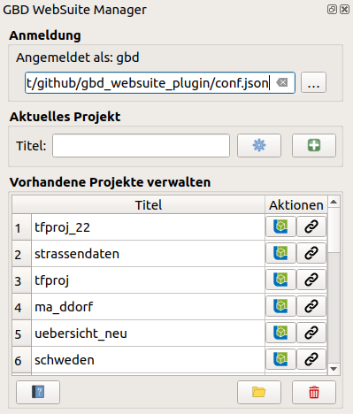
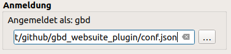
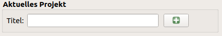

GBD WebSuite Manager Benutzerhandbuch
=====================================

Benutzerhandbuch für das GBD WebSuite Manager Plugin

Übersicht
---------

Das |gws| GBD WebSuite Manager Plugin ist eine Erweiterung die in QGIS installiert werden kann. Es ermöglicht die direkte Bereitstellung von QGIS Projekten in der GBD WebSuite.

Das Plugin kann über folgenden Link heruntergeladen und dann als ZIP-Datei in QGIS eingebunden werden:

 https://plugins-ng.gbd-consult.de/

Eine direkte Einbindung des Plugin-Repository in QGIS ist über diesen Link möglich:

https://plugins-ng.gbd-consult.de/plugins.xml

Wenn das Plugin installiert ist, ist es in QGIS unter Web -> GBD WebSuite -> GBD WebSuite Manager zu finden.
Alternativ kann es in den Werkzeugkästen ausgewählt und somit prominent in die Werkzeugleiste integriert werden.
Die einzelnen Funktionen werden im jeweiligen Menüpunkt genauer erklärt.

Anmelden
--------

Bevor Sie das GBD WebSuite Manager Plugin nutzen können müssen Sie sich auf dem GBD WebSuite Server anmelden.
Dafür benötigt man eine Login-Datei im JSON-Format. In dieser muss der Nutzername mit Passwort und die Serveradresse abgelegt werden.
Der Aufbau der JSON-Datei entnehmen Sie bitte folgendem Screenshot. Zwischen den grünen Anführungszeichen müssen die Werte für Nutzername, Passwort und Serveradresse eingetragen werden.

.. figure:: screenshots/loginexample.png
  :align: center

Wenn diese Datei angelegt ist, kann man über den |browse| ``Durchsuchen``-Button im GBD WebSuite Plugin, den Dateibrowser öffnen und die JSON-Datei auswählen.
Wenn die Logindaten richtig angelegt und auf dem Server als registrierter Nutzer eingetragen ist, verbindet das Plugin sich automatisch.

Außerdem ist es möglich eine automatische Anmeldung einzurichten, sodass die Logindatei nicht jedes mal manuell ausgewählt werden muss.
Dazu muss unter dem Pfad '.local/share/QGIS/QGIS3/profiles/default' der Ordner 'GBD_WebSuite' angelegt werden.
Kopieren Sie dann in '.local/share/QGIS/QGIS3/profiles/default/GBD_WebSuite' die Logindatei.
Wichtig ist zu beachten, das die Logindatei als 'conf.json' bennant ist.

Aktuelles Projekt
-----------------

Hier können Sie ihr aktuelles QGIS Projekt in die GBD WebSuite hochladen. Es werden sämtliche Raster- und Vektorlayer sowie deren Darstellungsoptionen mit übernommen.

Tragen Sie den gewünschten Titel ein, der in die GBD WebSuite übernommen werden soll.
Über die |options| ``Erweiterten Einstellungen``  können Sie auswählen, welche Werkzeuge der GBD WebSuite diesem Projekt zur Verfügung gestellt werden.
Wenn alles angepasst ist, muss man nur noch auf |add| ``Aktuelles Projekt hinzufügen`` klicken und das Projekt wird direkt in die GBD WebSuite hochgeladen.

Vorhandene Projekte verwalten
-----------------------------

Anhand dieser Liste kann man eine Übersicht über die hochgeladenen Projekte gewinnen.
Das gewählte Projekt kann man über |gws| ``Öffne die WebSuite`` sich in der WebSuite anzeigen lassen.
Über |link| ``Link anzeigen`` kann man sich den Projektlink anzeigen lassen.

Drei Werkzeuge am unteren Rand.
Über Hilfe gelangt man zur ausführlichen Hilfe und Dokumentation.
Durch Klicken des Button ``ausgewähltes Projekt anzeigen`` öffnet man das gewählte Projekt lokal in QGIS.
Mit Hilfe des |trash| Button kann das gewählte Projekt vom Server gelöscht werden.

.. |browse| image:: images/more_horiz-24px.svg
  :width: 30em
.. |gws| image:: images/gws_logo.svg
  :width: 30em
.. |add| image:: images/mActionAdd.svg
  :width: 30em
.. |options| image:: images/options.png
  :width: 2em
.. |link| image:: images/link.svg
  :width: 30em
.. |trash| image:: images/mActionTrash.png
  :width: 2em

.. .. toctree::
..     :maxdepth: 1

..   functions.rst
..   login.rst
..   edit_project.rst
..   manage_projects.rst
